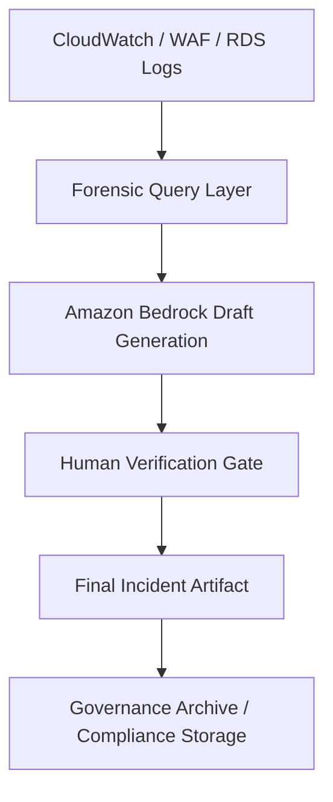

# T.I.Q.S. DevSecOps™ Incident Intelligence Framework


---


---

## [LinkedIn Executive Summary](/docs/LinkedIn_Executive_Summary.md)

I recently built and documented a governance-first, AI-assisted Incident Intelligence Framework designed for enterprise cloud environments.

This framework integrates Amazon Bedrock for structured incident analysis while enforcing strict human verification controls to prevent AI hallucination or compliance drift.

It includes:

- Evidence-first forensic workflows
- CloudWatch, WAF, and RDS telemetry correlation
- NIST 800-61 lifecycle mapping
- SOC 2 and ISO 27001 control alignment
- AI model audit logging
- Governance-ready incident artifacts

> **The key principle:** AI accelerates analysis. Humans own correctness.
> This project demonstrates advanced DevSecOps maturity, cloud-native operational discipline, and enterprise-grade compliance integration.
>> If your organization is exploring AI-assisted operations, secure cloud governance, or next-generation incident response workflows, I’d be happy to discuss.

---

## Repository Navigation

- 📘 [Governance Runbook](/docs/Governance_Runbook.md)
- 🧠 [T.I.Q.S. Incident Intelligence Framework](/docs/TIQS_Incident_Intelligence_Framework.md)
- 🏗 [Architecture Diagram](/docs/architecture/lab1-diagram.png)

---

## Architecture Overview



---

## 📁 Recommended Repository Structure

```text
lab-1c-bonus-i/
│
├── docs/
│   ├── architecture/
│   │   └── lab1-diagram.png
│   └── assets/
│       ├── banner-dark.png
│       ├── banner-light.png
│       └── tiqs-logo.png
│   ├── Governance_Runbook.md
│   ├── LinkedIn_Executive_Summary.md
│   └── TIQS_Incident_Intelligence_Framework.md
└── README.md
```

---

## Core Framework Pillars

### 1. Evidence-First Investigation

- Logs Insights forensic queries
- Alarm validation
- WAF traffic correlation
- Configuration drift inspection

### 2. AI-Augmented Analysis

- Timeline reconstruction
- Hypothesis acceleration
- Preventive control recommendations

### 3. Human Accountability Layer

- Mandatory verification checkpoint
- Confidence assignment
- Redaction enforcement
- Governance approval

### 4. Preventive Engineering Loop

- Automated secrets rotation
- Drift detection enforcement
- Infrastructure-as-Code discipline
- Post-incident guardrail updates

---

## Governance Alignment

### NIST 800-61

| Phase           | Implementation         |
| --------------- | ---------------------- |
| Preparation     | Monitoring & alerting  |
| Detection       | Logs + Bedrock draft   |
| Containment     | Controlled remediation |
| Eradication     | Config correction      |
| Recovery        | Telemetry validation   |
| Lessons Learned | Preventive controls    |

---

### SOC 2 Trust Services Criteria

| Domain               | Coverage                   |
| -------------------- | -------------------------- |
| Security             | Access control + redaction |
| Availability         | Alarm-driven workflow      |
| Processing Integrity | Evidence validation        |
| Confidentiality      | Secret isolation           |

---

### ISO 27001 Mapping

| Control | Implementation                  |
| ------- | ------------------------------- |
| A.12    | Logging & monitoring            |
| A.16    | Incident management lifecycle   |
| A.18    | Compliance & audit traceability |

---

## AI Governance Controls

- No AI access to live credentials
- No automated remediation
- Model ID audit logging required
- Human ownership of correctness

---

## Why This Matters

This repository demonstrates:

- AI safety engineering
- Cloud-native IR maturity
- Enterprise governance discipline
- Compliance-ready documentation
- Structured DevSecOps leadership

---

## Author

- **T.I.Q.S. DevSecOps™**
- **Cloud • Security • Governance • AI-Safe Engineering**
