# 🛡️ AWS Lab 1C (Bonus C)


---

## 📌 Task Overview

This lab implements a **real-world enterprise ingress pattern** using Terraform:

- **Private EC2 compute** (no public IPs)
- **Public Application Load Balancer (ALB)** as the only ingress
- **TLS via AWS Certificate Manager (ACM)**
- **Authoritative DNS via Route53**
- **Infrastructure as Code (IaC)** with Terraform

The final result exposes the application securely over **HTTPS** while keeping compute fully private.

---

## 🎯 Task Requirements

### Core Requirements

- Private EC2 instances (no public IPs)
- Internet-facing Application Load Balancer
- **HTTPS** listener on port 443
- Valid ACM certificate (`ISSUED`)
- **Route53** **DNS** record pointing to the ALB
- Terraform-managed infrastructure

### Bonus / Enterprise Practices

- Reuse existing hosted zone (no zone creation)
- **Alias A record** at apex/root domain
- Wildcard certificate reuse where applicable
- Clean **DNS** delegation
- Least-privilege access patterns

---

## 🗂️ Project Structure

```plaintext
lab-1c-bonus-c/
├── Screenshots/
|   ├── bonus-c-pt1.jpg
|   ├── bonus-c-pt2.jpg
|   ├── route53-init.jpg
|   ├── route53-list.jpg
|   ├── s3-logs.jpg
|   ├── ssm-init.jpg
|   ├── ssm-list.jpg
|   ├── terraform-apply.jpg
|   ├── terraform-destroy.jpg
|   ├── terraform-init-fmt-validate.jpg
|   └── terraform-plan.jpg
|
├── scripts/
|   ├── cloudwatch.log
|   ├── lab-1c-bonus-c-waf-logs.csv
|   └── user_data.sh
|
├── .gitignore
├── 1-versions.tf
├── 2-providers.tf
├── 3-locals.tf
├── 4-main.tf
├── 5-variables.tf
├── 6-route53.tf
├── 7-outputs.tf
├── README.md
└── STEPS.md
```

---

## 🚀 Terraform Deployment Steps

```bash
terraform init
terraform fmt
terraform validate
terraform plan
terraform apply
```

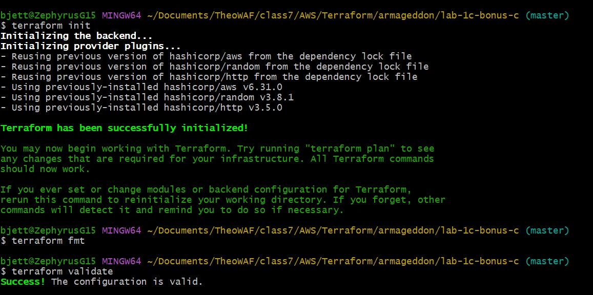
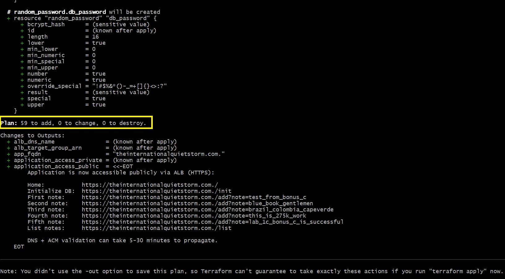
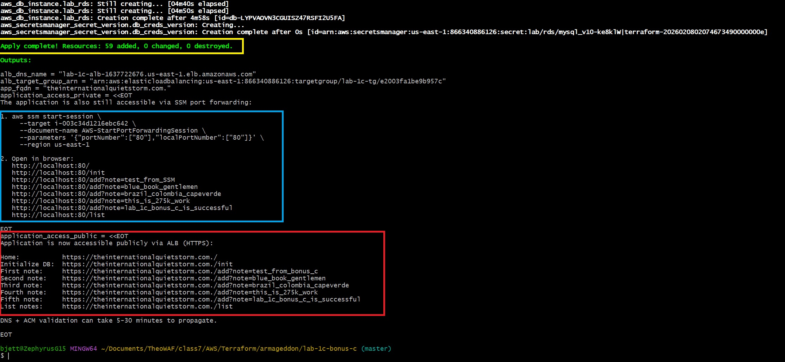

> Apply provisions networking, security groups, ALB, EC2, **DNS** records, and TLS integration.

---

## ✅ Screenshots

|Deliverable          |Description                                                   |Screenshot                                     |
|---------------------|--------------------------------------------------------------|-----------------------------------------------|
|`bonus-c-pt1.jpg`    |Route53 Hosted Zone and Record Sets                           |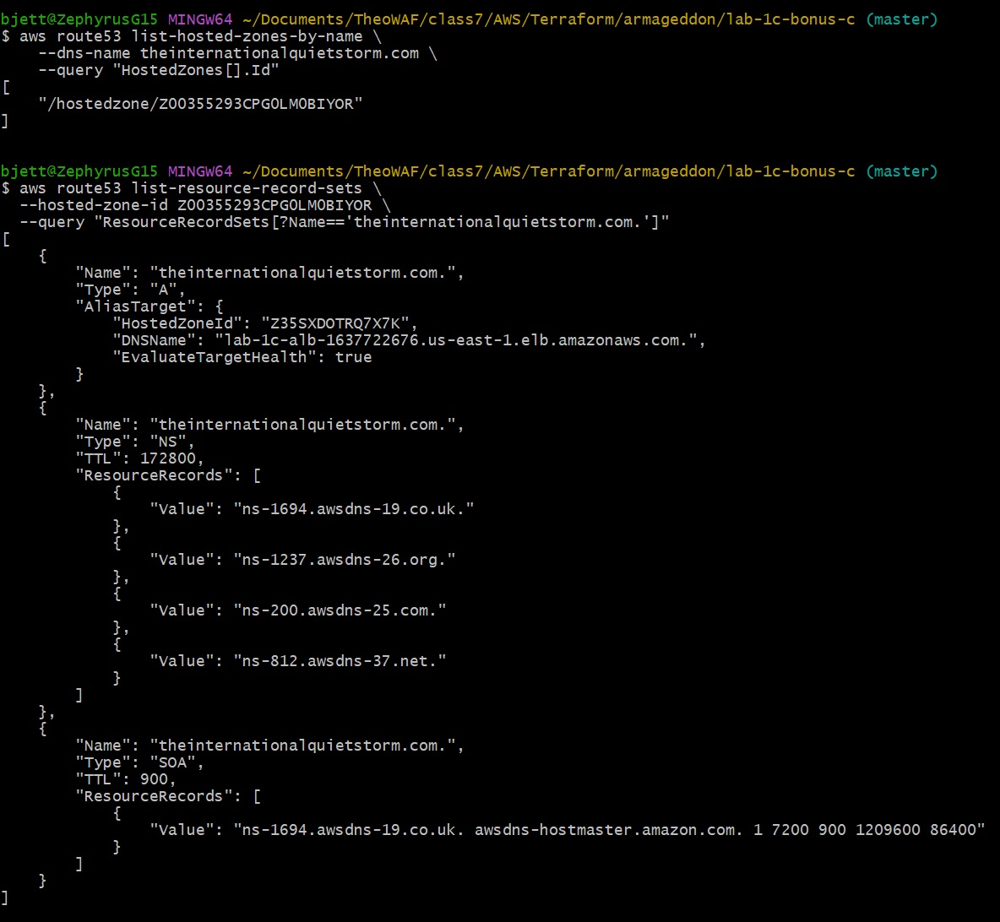    |
|`bonus-c-pt2.jpg`    |ACM certificate issued and **DNS** record created             |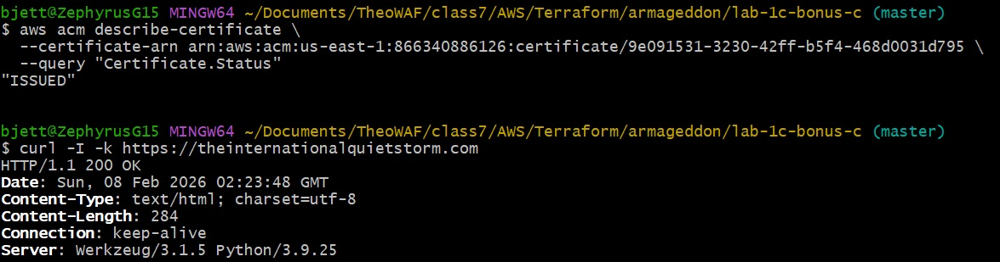    |
|`ssm-init.jpg`       |SSM Session Manager initialized for private EC2 access        |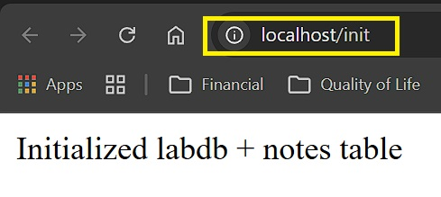          |
|`ssm-list.jpg`       |SSM Session Manager active sessions confirming connectivity   |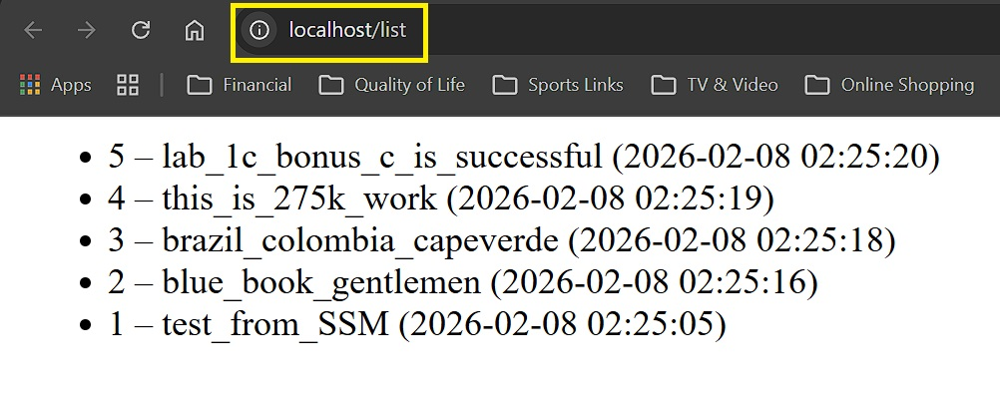          |
|`route53-init.jpg`   |Route53 hosted zone initialization                            |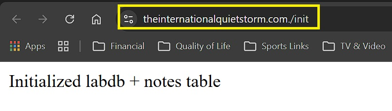  |
|`route53-list.jpg`   |Route53 record listing confirming ALB record                  |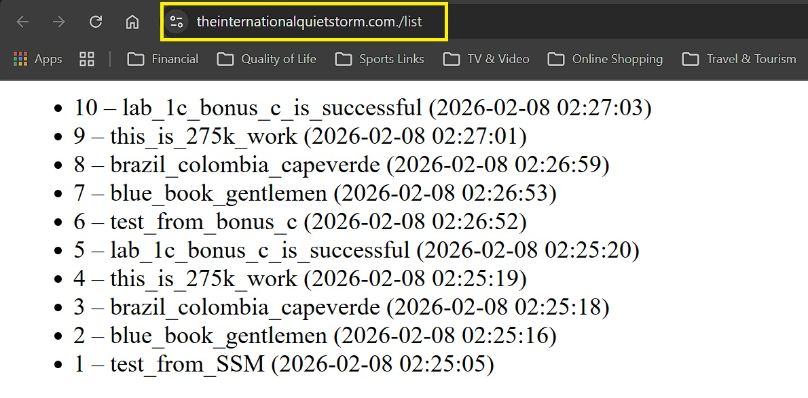  |
|`s3-logs.jpg`        |ALB access logs in S3 confirming traffic                      |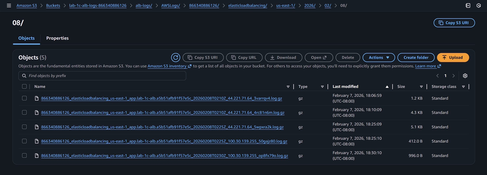            |

---

## 🧠 Additional Information

- **CloudWatch Logs**: ALB access logs are stored in S3 and can be analyzed for traffic patterns.

```log
-----------------------------------------------------------------
|   timestamp   |                    message                    |
|---------------|-----------------------------------------------|
| 1770516668988 | Watchtower enabled: CloudWatch logging active |
| 1770516669001 | Starting app on port 80                       |
| 1770517496730 | Retrieved credentials from Secrets Manager    |
| 1770517496923 | Database initialized successfully             |
| 1770517505186 | Note added: test_from_SSM                     |
| 1770517516491 | Note added: blue_book_gentlemen               |
| 1770517518341 | Note added: brazil_colombia_capeverde         |
| 1770517519397 | Note added: this_is_275k_work                 |
| 1770517520413 | Note added: lab_1c_bonus_c_is_successful      |
| 1770517601848 | Retrieved credentials from Secrets Manager    |
| 1770517601857 | Database initialized successfully             |
| 1770517612743 | Note added: test_from_bonus_c                 |
| 1770517613914 | Note added: blue_book_gentlemen               |
| 1770517619706 | Note added: brazil_colombia_capeverde         |
| 1770517621584 | Note added: this_is_275k_work                 |
| 1770517623726 | Note added: lab_1c_bonus_c_is_successful      |
-----------------------------------------------------------------
```

- **WAFv2 Logs:** If WAF is enabled, logs can be exported to S3 for monitoring and analysis.
  
  - [AWS WAFv2 Logging](/scripts/lab-1c-bonus-c-waf-logs.csv)
  
  - WAF Logs: <https://github.com/user-attachments/assets/6a08711a-ea84-4d3b-a67b-fcbdded7df42>

---

## 🧪 Verification

See **[STEPS.md](STEPS.md)** for CLI verification commands validating:

- **DNS** delegation
- **Route53** records
- Certificate status
- **HTTPS** reachability

---

## 🧹 Teardown Instructions

```bash
terraform destroy
```

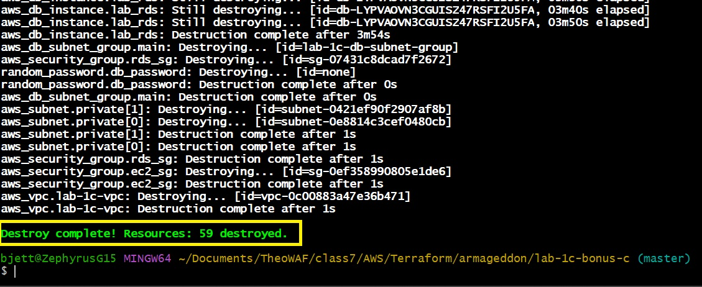

> Save/Delete your ALB logs in your S3 bucket before destroying to avoid data loss.

---

## 🧠 Troubleshooting

### **DNS does not resolve**

- Verify registrar nameservers match **Route53** NS records
- Disable DNSSEC during delegation changes
- Use `dig NS <domain>` to confirm authority

### **HTTPS fails**

- Confirm certificate status is `ISSUED`
- Ensure certificate matches hostname
- Remember: wildcard certs do **not** cover apex domains

### **Terraform errors**

- Run `terraform validate`
- Check for dangling references to removed resources

---

## 📚 References

- [https://docs.aws.amazon.com/elasticloadbalancing/latest/application/introduction.html](https://docs.aws.amazon.com/elasticloadbalancing/latest/application/introduction.html)
- [https://docs.aws.amazon.com/Route53/latest/DeveloperGuide/routing-to-elb-load-balancer.html](https://docs.aws.amazon.com/Route53/latest/DeveloperGuide/routing-to-elb-load-balancer.html)
- [https://docs.aws.amazon.com/acm/latest/userguide/acm-overview.html](https://docs.aws.amazon.com/acm/latest/userguide/acm-overview.html)
- [https://developer.hashicorp.com/terraform/docs](https://developer.hashicorp.com/terraform/docs)

---

## 👥 **Authors**

- **Author:** T.I.Q.S.
- **Group Leader:** John Sweeney
