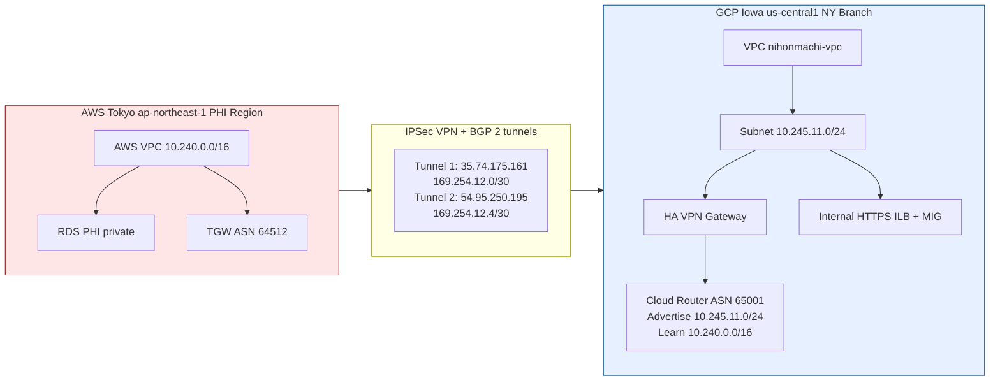

# 🏥 Lab 4A — Japan Medical (AWS ↔ GCP Secure Connectivity (IPSec VPN + BGP))


---

## 🎓 **Career Takeaway**

> Many engineers can configure VPNs.
> Few can do it safely, compliantly, and defensibly.

This lab demonstrates:

- Multi-cloud coordination
- BGP routing discipline
- Secrets handling maturity
- Regulated environment design

---

## 🗣️ **Interview Talk Track**

> “We connected a GCP-based medical branch to AWS using IPSec VPN and BGP, while ensuring all PHI remained in Japan. The GCP side ran compute only, and routing was tightly controlled to meet compliance requirements.”

---

## 🎯 **Lab Objective**

Design and validate secure, compliant multi-cloud connectivity between:

- **AWS Tokyo (ap-northeast-1)** → Authoritative PHI Region  
- **GCP Iowa (us-central1)** → New York branch compute  

**Using:**

- IPSec Site-to-Site VPN  
- BGP for dynamic routing  
- Private IP routing only  
- Strict compliance boundaries  
- No PHI storage outside Japan  

This lab simulates real-world regulated multi-cloud architecture.

---

## 🧠 **Why This Lab Exists**

Real enterprises operate under:

- Legal constraints
- Data localization laws
- Multi-cloud environments
- Separate infrastructure teams
- Compliance audits

This lab emphasizes **discipline, routing control, and secrets management** over “just making it work.”

> Secure connectivity is as much about process as it is about packets.

---

## 🌍 **Architecture Overview**

## Regions

| Provider | Region             | Role                         |
|----------|--------------------|------------------------------|
| **AWS**  | **ap-northeast-1** | **PHI authoritative region** |
| **GCP**  | **us-central1**    | **Compute-only branch**      |

---

## 🏗️ **Lab Requirements**

### 🔐 **Security Constraints (Non-Negotiable)**

- ❌ No PHI stored in GCP
- ❌ No databases in GCP
- ❌ No disk persistence of medical data
- ❌ No PHI logging
- ✅ Encrypted IPSec VPN tunnels
- ✅ Explicit BGP route control
- ✅ Out-of-band PSK handling
- ✅ Secrets not committed to Git

If it works but violates these — it fails.

---

## 🧩 **Project Structure**

```text
LAB-4/
├── full-audit-2026/
│   ├── ny/
│   │   ├── gcp_evidence.json
│   │   ├── gcp_firewall_rules.txt
│   │   ├── gcp_forwarding_rules.txt
│   │   └── gcp_vpn_tunnels.txt
│   └── tokyo/
│       ├── aws_evidence.json
│       ├── aws_routes.txt
│       ├── aws_vpn_connections.txt
│       └── cloudtrail_recent_full.json
│
├── modules/
│   ├── aws_tokyo/
│   │   ├── 1-variables.tf
│   │   ├── 2-main.tf
│   │   └── 3-outputs.tf
│   │
│   ├── gcp_iowa/
│   │   ├── 1-variables.tf
│   │   ├── 2-network.tf
│   │   ├── 3-nat.tf
│   │   ├── 4-firewall.tf
│   │   ├── 5-compute.tf
│   │   ├── 6-ilb.tf
│   │   ├── 7-vpn.tf
│   │   ├── 8-iam.tf
│   │   ├── 9-outputs.tf
│   │   └── startup.sh.tftpl
│   ├── vpn/
│   │   ├── 1-variables.tf
│   │   ├── 2-main.tf
│   │   └── 3-outputs.tf
│
├── python/
│   └── malgus_collect_evidence.py
│
├── Screenshots/
│   ├── lab4-aws-tgw.jpg
│   ├── lab4-aws-vpn.jpg
│   ├── lab4-deliverable-pt1.jpg
│   ├── lab4-deliverable-pt2.jpg
│   ├── lab4-deliverable-pt3.jpg
│   ├── lab4-deliverable-pt4.jpg
│   ├── lab4-deliverable-pt5.jpg
│   ├── lab4-gcloud-compute-routers-pt1.jpg
│   ├── lab4-gcloud-compute-routers-pt2.jpg
│   ├── lab4-gcp-ilb.jpg
│   ├── lab4-gcp-mig.jpg
│   ├── lab4-gcp-vpn.jpg
│   ├── lab4-malgus-collect-evidence.jpg
|   ├── lab4-rds-pt1.jpg
|   ├── lab4-rds-pt2.jpg
│   ├── terraform-apply.jpg
│   ├── terraform-destroy.jpg
│   ├── terraform-init-fmt-validate.jpg
│   └── terraform-plan.jpg
│
├── .gitattributes
├── .gitignore
├── 0-versions.tf
├── 1-providers.tf
├── 2-variables.tf
├── 3-locals.tf
├── 4-main.tf
├── 5-outputs.tf
├── README.md
└── STEPS.md
```

---

## 🚀 **Terraform Deployment Steps**

### 1️⃣ **Initialize, Format, & Validate**

```bash
terraform init
terraform fmt -recursive
terraform validate
```

  

### 2️⃣ **Plan**

```bash
terraform plan
```

  

### 3️⃣ **Apply**

```bash
terraform apply
```

  

---

## 💼 **Why This Layout Works for Portfolio**

- Clearly separates AWS and GCP responsibilities
- Demonstrates BGP establishment proof
- Shows routing discipline
- Shows internal-only access design
- Shows compute-only GCP implementation
- Includes automation evidence (Python script)

---

## 📸 **Infrastructure Build Evidence**

### 🔄 **AWS Side — Tokyo (ap-northeast-1)**

| Deliverable | Description                          | Screenshot                                          |
| ----------- | ------------------------------------ | ----------------------------------------------------|
| 1           | Transit Gateway Created              |   |
| 2           | RDS Database Configuration (Part I)  |   |
| 3           | RDS Database Configuration (Part II) |   |

---

### 🔄 **GCP Side — Iowa (us-central1)**

| Deliverable | Description                          | Screenshot                                                                               |
| ----------- | ------------------------------------ | ---------------------------------------------------------------------------------------- |
| 1           | Internal HTTPS Load Balancer         |                                        |
| 2           | Managed Instance Group (MIG)         |                                        |

---

## 📦 **Artifacts & Deliverables**

### 📦 **Deliverable 1 — Connectivity Evidence**

#### **GCP Side**

```bash
gcloud compute routers get-status nihonmachi-router --region us-central1
```


**Evidence:**


- BGP session `Established`
- Correct CIDRs learned

#### **AWS Side**

**Show:**

  |

- TGW route table entries
- BGP peer status
- Only 10.240.0.0/16 and 10.245.11.0/24 exchanged

---

### 📦 **Deliverable 2 — Network Diagram**



---

### 📦 **Deliverable 3 — Private-Only Access Proof (GCP ILB)**

```bash
gcloud compute forwarding-rules describe lab-4-fr --region us-central1
```


**From inside VPN corridor:**

```bash
curl -k https://<INTERNAL_LB_IP>/health
curl -k https://<INTERNAL_LB_IP>/
```


**From Public Internet:**

```bash
curl -k https://<INTERNAL_LB_IP>/health
curl -k https://<INTERNAL_LB_IP>/
```


**Expected:**

- Works internally
- Fails externally

---

### 📦 **Deliverable 4 — MIG Proof**

```bash
gcloud compute instance-groups managed list --regions us-central1
gcloud compute instances list --filter="name~nihonmachi-app"
```


**Include:**

- MIG exists
- Multiple instances running

---

### 📦 **Deliverable 5 — Tokyo RDS Connectivity Proof**

From VM:

```bash
python3 /usr/local/bin/rds_test.py
```


---

### 📦 **Deliverable 6 — Malgus Python**

```bash
chmod +x python/malgus_collect_evidence.py
python python/malgus_collect_evidence.py
```


- [**Malgus Python Script**](python/malgus_collect_evidence.py)
- [**Full Audit Folder**](full-audit-2026/)

---

### 📦 **Deliverable 7 — Process Write-Up (PSK Discipline)**

#### Pre-shared keys (PSKs)

- Pre-shared keys were generated using a high-entropy password generator. Each tunnel used a unique PSK to isolate failure domains and allow independent rotation. The PSKs were never stored in Terraform code, committed to Git, or shared over chat. Instead, they were stored temporarily in a secure password manager and shared out-of-band as a one-time secret. Terraform consumed PSKs via a local secrets.auto.tfvars file excluded from version control. In regulated environments, VPN credentials represent direct encrypted access into sensitive networks. Any leakage creates an unauthorized access path. Proper PSK handling demonstrates audit readiness and operational maturity.

---

### 📦 **Deliverable 8 — Compliance Statement**

No data is stored in GCP because the Iowa environment is compute-only and does not deploy databases or persistent storage for PHI. All regulated data remains within AWS Tokyo, the authoritative region. Access to the Tokyo RDS instance occurs exclusively over encrypted IPSec VPN tunnels using BGP for controlled routing, ensuring that only explicitly approved CIDRs are exchanged. Multi-cloud in this architecture separates compute from storage responsibilities without expanding the PHI storage footprint. Therefore, Japanese data residency requirements remain satisfied while still enabling operational flexibility.

---

## 🛠️ **Additional Screenshots**

**Include:**

- AWS TGW configuration
- GCP HA VPN configuration
- Cloud Router BGP peer status
- Network Connectivity Center
- Firewall rules
- Terraform apply success
- Internal HTTPS Load Balancer configuration

---

## 🧹 **Tear Down Steps**

### **Terraform Destroy**

```bash
terraform destroy
```

  

---

## 🧠 **References**

### 📚 **AWS References**

- [https://docs.aws.amazon.com/vpc/latest/tgw/](https://docs.aws.amazon.com/vpc/latest/tgw/)
- [https://docs.aws.amazon.com/vpn/latest/s2svpn/](https://docs.aws.amazon.com/vpn/latest/s2svpn/)
- [https://docs.aws.amazon.com/vpc/latest/tgw/what-is-transit-gateway.html](https://docs.aws.amazon.com/vpc/latest/tgw/what-is-transit-gateway.html)

### 📚 **GCP References**

- [https://cloud.google.com/network-connectivity/docs/vpn](https://cloud.google.com/network-connectivity/docs/vpn)
- [https://cloud.google.com/network-connectivity/docs/router](https://cloud.google.com/network-connectivity/docs/router)
- [https://cloud.google.com/load-balancing/docs/l7-internal](https://cloud.google.com/load-balancing/docs/l7-internal)

---

## 🧯 **Troubleshooting Guide**

### ❌ **BGP Not Established**

- Verify ASN matches
- Verify inside tunnel IPs
- Verify PSKs match
- Confirm firewall rules

### ❌ **Routes Not Learned**

- Check Cloud Router advertisement mode
- Confirm TGW route propagation
- Verify CIDR correctness

### ❌ **Internal LB Not Reachable**

- Confirm firewall rules
- Confirm health checks passing
- Confirm instance listening on 443
- Confirm ILB IP is internal

### ❌ **RDS Connection Fails**

- Confirm AWS Security Group allows GCP CIDR
- Confirm route tables
- Confirm correct DB endpoint

---

## 🧠 **Final Reminder**

Secure connectivity is not about speed.
It is about control, discipline, and defensibility.

---

## 👥 **Authors**

- **Author:** T.I.Q.S.
- **Group Leader:** John Sweeney
