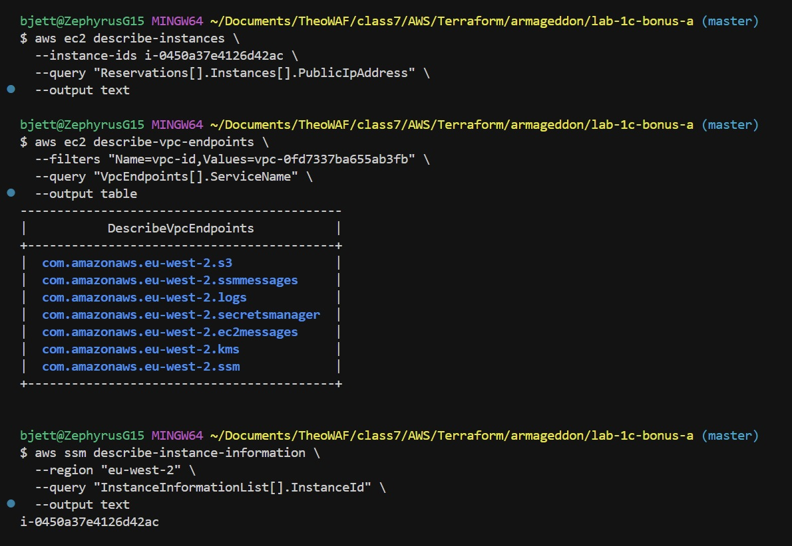
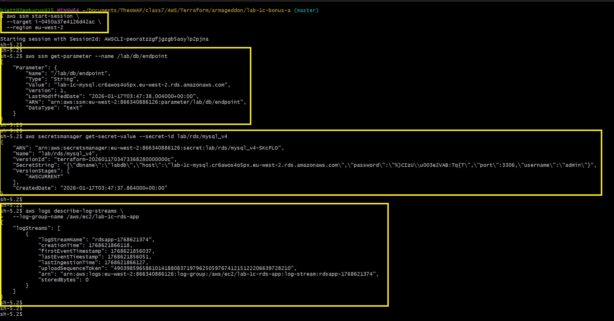
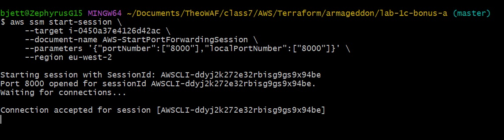

# Lab 1C - Bonus A – Private EC2 App w/ RDS & SSM Session Manager

[](https://www.terraform.io)
[](https://registry.terraform.io/providers/hashicorp/aws)
[](https://aws.amazon.com/about-aws/global-infrastructure/regional-product-services/)
[](https://aws.amazon.com/vpc/)
[](https://docs.aws.amazon.com/systems-manager/latest/userguide/session-manager.html)
[](https://aws.amazon.com/blogs/networking-and-content-delivery/introducing-vpc-endpoints-for-amazon-s3/)
[](https://aws.amazon.com/cloudwatch/)
[](https://aws.amazon.com/security/least-privilege/)
[](https://github.com/lincolnloop/watchtower)

Fully private **EC2 instance** running a **Flask** notes application, connected to **RDS MySQL via Secrets Manager**, accessible only through **AWS Systems Manager Session Manager** (*no public IP, no SSH, no NAT Gateway*). All AWS service communication occurs through **VPC Interface Endpoints.**

---

## Task Overview

**Lab 1C Bonus A** requires the deployment of a secure, private application architecture in AWS using Terraform with the following objectives:

- EC2 instance placed in a private subnet with **no public IP address**
- Access to the instance exclusively via **AWS Systems Manager Session Manager** (no SSH keys, no bastion host, no inbound ports open)
- Elimination of **NAT Gateway** dependency — private subnets communicate with AWS services only through **VPC Interface Endpoints**
- Required VPC endpoints: `ssm`, `ssmmessages`, `ec2messages`, `logs`, `secretsmanager` (plus optional `kms`)
- **S3 Gateway** Endpoint for package and artifact access
- Strict least-privilege IAM policies for **Secrets Manager and SSM Parameter Store** access
- Application logs delivered to **CloudWatch Logs** (using watchtower library)
- Complete observability and monitoring setup **(metric filters, alarms, SNS notifications.)**

---

## Task Requirements Needed

- AWS account with permissions to create **VPC, EC2, RDS, IAM, VPC Endpoints, CloudWatch, SNS, and Secrets Manager** resources
- **Terraform** ≥ 1.9
- Configured **AWS CLI** credentials with sufficient privileges
- Existing **AWS key pair** (optional – for emergency console access only)
- Email address for **SNS** subscription (for alarm notifications)

---

## Project Structure

```plaintext
lab-1c-bonus-a/
├── scripts/
│   └── user_data.sh                    # Bootstraps app, dependencies, and systemd service
├── Screenshots/                        # Visual evidence of deployment & functionality
│   ├── bonus-a-pt1.jpg                 # VPC & endpoints overview
│   ├── bonus-a-pt2.jpg                 # SSM connectivity proof
│   ├── bonus-a-pt3.jpg                 # Application running via port forwarding
│   ├── init.jpg                        # /init endpoint success
│   ├── list.jpg                        # /list endpoint with notes
│   ├── note1.jpg
│   ├── note2.jpg
│   ├── note3.jpg
│   ├── note4.jpg
│   ├── note5.jpg
│   ├── terraform-apply.jpg             # Successful apply output
│   ├── terraform-destroy.jpg           # Clean destroy confirmation
│   ├── terraform-init-fmt-validate.jpg # Initialization & validation
│   └── terraform-plan.jpg              # Execution plan output
├── .gitignore
├── 1-versions.tf
├── 2-providers.tf
├── 3-locals.tf
├── 4-main.tf
├── 5-variables.tf
├── 6-outputs.tf
├── README.md                           # This file
└── STEPS.md                            # Step-by-step deployment instructions
```

---

## Shell Scripts Added

### `scripts/user_data.sh`

Install **Python** dependencies, deploy **Flask Notes App**, configure `systemd` service,  and send **CloudWatch Logs to SNS** via Watchtower.

  ```bash
  #!/bin/bash
  set -Eeuo pipefail

  echo "Starting user data script - $(date)"
  trap 'echo "User data script completed (exit code $?) - $(date)"' EXIT

  # IMDS readiness + IMDSv2 support
  echo "Waiting for instance metadata service (IMDS)..."
  until curl -s --max-time 2 http://169.254.169.254/latest/meta-data/ >/dev/null 2>&1; do
    sleep 2
  done
  echo "IMDS is reachable"

  TOKEN="$(curl -sS -X PUT "http://169.254.169.254/latest/api/token" \
    -H "X-aws-ec2-metadata-token-ttl-seconds: 21600" || true)"

  imdscurl() {
    if [ -n "${TOKEN}" ]; then
      curl -sS -H "X-aws-ec2-metadata-token: ${TOKEN}" "$@"
    else
      curl -sS "$@"
    fi
  }

  DOC="$(imdscurl http://169.254.169.254/latest/dynamic/instance-identity/document || true)"
  if [ -z "${DOC}" ]; then
    echo "ERROR: Could not read instance-identity document from IMDS. Check IMDS settings (IMDSv2 required?)"
    exit 1
  fi

  if command -v python3 >/dev/null 2>&1; then
    AWS_REGION="$(printf '%s' "${DOC}" | python3 -c 'import sys,json; print(json.load(sys.stdin)["region"])')"
  else
    AWS_REGION="$(printf '%s' "${DOC}" | tr -d '\n' | sed -n 's/.*"region"[[:space:]]*:[[:space:]]*"\([^"]*\)".*/\1/p')"
  fi

  export AWS_REGION
  echo "Detected AWS region: ${AWS_REGION}"

  # App configuration
  PREFIX="${PREFIX:-lab-1c}"
  SECRET_ID="${SECRET_ID:-lab/rds/mysql_v5}"
  export PREFIX SECRET_ID

  echo "Using PREFIX=${PREFIX}"
  echo "Using SECRET_ID=${SECRET_ID}"

  echo "Checking VPC endpoint DNS resolution..."
  for svc in ssm ssmmessages ec2messages logs secretsmanager kms; do
    if ! getent hosts "${svc}.${AWS_REGION}.amazonaws.com" >/dev/null 2>&1; then
      echo "WARN: ${svc}.${AWS_REGION}.amazonaws.com not resolvable (check Private DNS on endpoint)"
    fi
  done
  echo "Network checks complete"

  # NAT-less dependency install via OS repos (NO pip / NO public PyPI)
    echo "Installing Python runtime + required modules via dnf (NAT-less)..."

  if ! command -v dnf >/dev/null 2>&1; then
    echo "ERROR: dnf not found. This script expects Amazon Linux 2023 / RHEL-family AMI."
    exit 1
  fi

  # Soft timeouts prevent long hangs in restricted networks
  timeout 600 dnf -y update || echo "WARN: dnf update failed/timed out (continuing)"
  timeout 600 dnf -y install python3 python3-pip || echo "WARN: python3/python3-pip install failed/timed out (continuing)"

  # Install required Python modules from OS repos
  timeout 600 dnf -y install \
    python3-boto3 \
    python3-flask \
    python3-pymysql \
    || echo "WARN: One or more python3-* packages not available in repo."

  # Optional: watchtower (may not exist in AL2023 repos)
  # If unavailable, app will still run; it will just skip CloudWatch logging via watchtower.
  timeout 300 dnf -y install python3-watchtower 2>/dev/null || echo "INFO: python3-watchtower not available; CloudWatch logging via watchtower will be disabled."

  echo "Validating Python imports..."
  python3 - <<'PY'
  import sys
  missing = []
  for m in ("boto3", "flask", "pymysql"):
      try:
          __import__(m)
      except Exception:
          missing.append(m)
  if missing:
      print("ERROR: Missing Python modules after dnf install: " + ", ".join(missing))
      print("Fix: ensure repo mirror contains python3-boto3/python3-flask/python3-pymysql OR bake deps into AMI.")
      sys.exit(1)
  print("OK: Required modules present: boto3, flask, pymysql")
  try:
      import watchtower
      print("OK: watchtower present (CloudWatch logging enabled)")
  except Exception:
      print("INFO: watchtower not present (CloudWatch logging disabled; journald still works).")
  PY

  # Application setup
  mkdir -p /opt/rdsapp
  cat > /opt/rdsapp/app.py << 'EOF'
  import json
  import os
  import time
  import logging
  import boto3
  import pymysql
  from flask import Flask, request

  logging.basicConfig(level=logging.INFO)
  logger = logging.getLogger("rds-notes-app")

  # Optional CloudWatch logging via watchtower (only if installed)
  try:
      import watchtower
      cloudwatch_handler = watchtower.CloudWatchLogHandler(
          log_group_name=f"/aws/ec2/{os.environ.get('PREFIX', 'lab-1c')}-rds-app",
          stream_name=f"rdsapp-{int(time.time())}",
          send_interval=10,
          boto3_client=boto3.client("logs", region_name=os.environ.get("AWS_REGION"))
      )
      logger.addHandler(cloudwatch_handler)
      logger.info("Watchtower enabled: CloudWatch logging active")
  except Exception as e:
      logger.warning("Watchtower disabled: %s", e)

  console_handler = logging.StreamHandler()
  console_handler.setFormatter(logging.Formatter('%(asctime)s [%(levelname)s] %(message)s'))
  logger.addHandler(console_handler)

  REGION = os.environ.get("AWS_REGION")
  SECRET_ID = os.environ.get("SECRET_ID")

  if not REGION:
      raise RuntimeError("AWS_REGION is not set")
  if not SECRET_ID:
      raise RuntimeError("SECRET_ID is not set")

  secrets_client = boto3.client("secretsmanager", region_name=REGION)

  def get_db_creds():
      resp = secrets_client.get_secret_value(SecretId=SECRET_ID)
      return json.loads(resp["SecretString"])

  def get_db_connection():
      creds = get_db_creds()
      return pymysql.connect(
          host=creds["host"],
          user=creds["username"],
          password=creds["password"],
          port=int(creds.get("port", 3306)),
          database=creds.get("dbname", "labdb"),
          autocommit=True,
          connect_timeout=10
      )

  app = Flask(__name__)

  @app.route("/")
  def home():
      return """
      <h2>Private EC2 → RDS Notes App (Bonus A)</h2>
      <p><a href="/init">/init</a> – initialize database</p>
      <p>/add?note=hello</p>
      <p><a href="/list">/list</a></p>
      <small>Private subnet – access via SSM port forwarding</small>
      """

  @app.route("/init")
  def init_db():
      creds = get_db_creds()
      conn = pymysql.connect(
          host=creds["host"],
          user=creds["username"],
          password=creds["password"],
          port=int(creds.get("port", 3306)),
          autocommit=True
      )
      with conn.cursor() as cur:
          cur.execute("CREATE DATABASE IF NOT EXISTS labdb")
          cur.execute("USE labdb")
          cur.execute("""
              CREATE TABLE IF NOT EXISTS notes (
                id INT AUTO_INCREMENT PRIMARY KEY,
                note VARCHAR(255),
                created_at TIMESTAMP DEFAULT CURRENT_TIMESTAMP
              )
          """)
      conn.close()
      logger.info("Database initialized successfully")
      return "Initialized labdb + notes table"

  @app.route("/add")
  def add_note():
      note = request.args.get("note", "").strip()
      if not note:
          return "note parameter required", 400
      with get_db_connection() as conn:
          with conn.cursor() as cur:
              cur.execute("INSERT INTO notes (note) VALUES (%s)", (note,))
      logger.info("Note added: %s", note)
      return f"Added: {note}"

  @app.route("/list")
  def list_notes():
      with get_db_connection() as conn:
          with conn.cursor() as cur:
              cur.execute("SELECT id, note, created_at FROM notes ORDER BY id DESC")
              rows = cur.fetchall()
      return "<ul>" + "".join(f"<li>{r[0]} – {r[1]} ({r[2]})</li>" for r in rows) + "</ul>"

  if __name__ == "__main__":
      logger.info("Starting app on port 8000")
      app.run(host="0.0.0.0", port=8000)
  EOF

  # systemd service (EnvironmentFile avoids substitution issues)
  cat > /etc/rdsapp.env <<EOF
  AWS_REGION=${AWS_REGION}
  PREFIX=${PREFIX}
  SECRET_ID=${SECRET_ID}
  EOF
  chmod 600 /etc/rdsapp.env

  cat > /etc/systemd/system/rdsapp.service <<'EOF'
  [Unit]
  Description=RDS Notes Application (private)
  After=network.target

  [Service]
  User=ec2-user
  WorkingDirectory=/opt/rdsapp
  EnvironmentFile=/etc/rdsapp.env
  ExecStart=/usr/bin/python3 /opt/rdsapp/app.py
  Restart=always
  RestartSec=10

  [Install]
  WantedBy=multi-user.target
  EOF

  systemctl daemon-reload
  systemctl enable --now rdsapp

  echo "rdsapp service started successfully - $(date)"
  ```

---

## Terraform Deployment Steps

1. **Clone the repository**

   ```bash
   git clone <repository-url>
   cd lab-1c-bonus-a
   ```

2. **Initialize Terraform**

   ```bash
   terraform init
   ```

3. **Format & validate configuration**

   ```bash
   terraform fmt -recursive
   terraform validate
   ```

4. **Generate execution plan**

   ```bash
   terraform plan
   ```

5. **Apply the infrastructure**

   ```bash
   terraform apply --auto-approve
   ```

6. **Wait 10–25 minutes** for **SSM Agent** registration in private **VPC** environment

7. **Verify SSM connectivity**

   ```bash
   aws ssm describe-instance-information \ 
     --region eu-west-2 \
     --output table
   ```

8. **Start port forwarding** (application runs on port 8000)

   ```bash
   aws ssm start-session \
     --target <instance-id-from-output> \
     --document-name AWS-StartPortForwardingSession \
     --parameters '{"portNumber":["8000"],"localPortNumber":["8000"]}' \
     --region eu-west-2
   ```

9. Access the application locally:
   - <http://localhost:8000>
   - <http://localhost:8000/init>
   - <http://localhost:8000/add?note=test_from_SSM>
   - <http://localhost:8000/add?note=blue_book_gentlemen>
   - <http://localhost:8000/add?note=brazil_colombia_capeverde>
   - <http://localhost:8000/add?note=this_is_250k_work>
   - <http://localhost:8000/add?note=lab_1c_bonus_a_is_successful>
   - <http://localhost:8000/list>

---

## Terraform Outputs

Run `terraform output` after successful deployment:

| **Terraform Output Name**         | **Screenshot**                                                                  |
|-----------------------------------|---------------------------------------------------------------------------------|
| `terraform-init-fmt-validate.jpg` |  |
| `terraform-plan.jpg`              |                            |
| `terraform-apply.jpg`             |                          |

---

## Project Deliverables

- [x] EC2 instance in private subnet (no public IP)
- [x] Access exclusively via AWS Systems Manager Session Manager
- [x] Required VPC Interface Endpoints for SSM, Logs, Secrets Manager
- [x] S3 Gateway Endpoint
- [x] Least-privilege IAM policies
- [x] Application logs delivered to CloudWatch
- [x] No NAT Gateway dependency
- [x] Successful SSM agent registration and port-forwarding demonstration
- [x] Visual evidence (Screenshots) of deployment, SSM access, and application functionality

---

## Screenshots

| Output Name               | Screenshot                                          |
|---------------------------|-----------------------------------------------------|
| `bonus-a-pt1.jpg`         |      |
| `bonus-a-pt2.jpg`         |      |
| `bonus-a-pt3.jpg`         |      |
| `init.jpg`                |                    |
| `note1.jpg`               |                  |
| `note2.jpg`               |                  |
| `note3.jpg`               |                  |
| `note4.jpg`               |                  |
| `note5.jpg`               |                  |
| `list.jpg`                |                    |

## Tear Down Steps

1. **Destroy all resources**

   ```bash
   terraform destroy --auto-approve
   ```

    

2. **Manual cleanup (if needed)**
   - Empty and delete any S3 buckets created for logs (if applicable)
   - Remove SNS email subscription from the AWS Console

---

## References

- AWS Systems Manager Session Manager Documentation  
  <https://docs.aws.amazon.com/systems-manager/latest/userguide/session-manager.html>
- VPC Endpoints for AWS Services  
  <https://docs.aws.amazon.com/vpc/latest/privatelink/vpce-interface.html>
- Watchtower – Python CloudWatch Logging Library  
  <https://github.com/kislyuk/watchtower>
- Terraform AWS Provider – VPC Endpoints  
  <https://registry.terraform.io/providers/hashicorp/aws/latest/docs/resources/vpc_endpoint>
- Amazon Linux 2023 SSM Agent  
  <https://docs.aws.amazon.com/systems-manager/latest/userguide/ssm-agent.html>

---

## Troubleshooting Steps

| **Symptom**                                      | **Likely Cause**                               | **Resolution Steps**                                               |
|--------------------------------------------------|------------------------------------------------|--------------------------------------------------------------------|
| **SSM Agent*8 not online / `TargetNotConnected`  | Missing or misconfigured VPC endpoints         | Verify all 3 SSM endpoints exist + correct security group rules    |
| No **CloudWatch log stream**                     | Missing `logs:CreateLogGroup` permission       | Add permission to IAM role → reboot instance                       |
| Application fails to start                       | Missing Python packages                        | Use golden AMI or enable temporary NAT for pip                     |
| Terraform cycle error                            | RDS endpoint in **Secrets Manager** secret     | Remove host from secret version → resolve at runtime               |
| Empty `describe-instance-information`            | IAM role not attached or insufficient perms    | Verify instance profile & `AmazonSSMManagedInstanceCore` policy    |

---

## **Author**

- **Author:** T.I.Q.S.
- **Group Leader:** John Sweeney

---
