# **Lab 1B & 1C – Validation & Incident Response in Terraform**

[](https://www.terraform.io)
[](https://registry.terraform.io/providers/hashicorp/aws/latest/docs)
[](https://www.python.org)
[](https://flask.palletsprojects.com)
[](https://www.mysql.com)
[](https://aws.amazon.com/about-aws/global-infrastructure/regions/sa-east-1/)
[](https://github.com/tiqsclass6/aws-armageddon-class-7.0/commits)

---

## **Table of Contents**

- **[Task Overview](#task-overview)**
- **[Project Structure](#project-structure)**
- **[Terraform Deployment Steps](#terraform-deployment-steps)**
- **[Audit Checks (Lab 1A)](#audit-checks-lab-1a)**
- **[Validation & Incident Response (Lab 1B)](#validation--incident-response-lab-1b)**
- **[Terraform Teardown / Cleanup](#terraform-teardown--cleanup)**
- **[Lab 1A Through 1C Deliverables](#lab-1a-through-1c-deliverables)**
- **[References](#references)**
- **[Troubleshooting](#troubleshooting)**
- **[Author](#author)**

---

## **Task Overview**

### `Lab 1B – Configuration Management & Parameter Store`

- Deployed a **Flask** application on **EC2** that interacts with **RDS MySQL**
- Stored DB connection details (`endpoint, port, name`) in SSM Parameter Store
- Stored DB credentials securely in **Secrets Manager**
- Implemented application logging to **CloudWatch Logs** using `watchtower`

### `Lab 1C – Monitoring, Alerting & Incident Response`

- Added **CloudWatch Logs** metric filter to detect connection errors
- Created **CloudWatch Alarm** that triggers on ≥3 connection failures in 5 minutes
- Configured **SNS topic** with email subscription for alarm notifications
- Simulated `credential drift` incident (wrong password)
- Followed structured runbook for detection, diagnosis, containment, recovery, and validation

---

## **Project Structure**

```plaintext
Lab-1c/
├── Screenshots/                    # Visual proof of deployment & incident
│   ├── db-instance-modify.mp4      # Secrets Manager password change process
│   ├── db-restored.mp4             # Secrets Manager password restored & app functional
│   ├── edit-secrets-pw-wrong.jpg
│   ├── edit-secrets-pw-right.jpg
│   ├── final-audit-pt1.jpg
│   ├── final-audit-pt2.jpg
│   ├── final-audit-pt3.jpg
│   ├── final-audit-pt4.jpg
│   ├── init.jpg
│   ├── lab-1b-pt1.jpg
│   ├── lab-1b-pt2.jpg
│   ├── lab-1b-pt3.jpg
│   ├── lab-1b-pt4.jpg
│   ├── list.jpg
│   ├── note1.jpg
│   ├── note2.jpg
│   ├── note3.jpg
│   ├── note4.jpg
│   ├── note5.jpg
│   ├── sns-pt1.jpg
│   ├── sns-pt2.jpg
│   ├── sns-pt3.jpg
│   ├── sns-pt4.jpg
│   ├── terraform-apply.jpg
│   ├── terraform-destroy.jpg
│   ├── terraform-init-fmt-validate.jpg
│   ├── terraform-plan.jpg
│   ├── wrong-app-pt1.jpg
│   ├── wrong-app-pt2.jpg
│   └── wrong-app-pt3.jpg
├── scripts/
│   ├── cloudwatch.log.sh           # Export CloudWatch Logs to local file
│   ├── gate_network_db.sh          # Audit: VPC, subnets, SG, RDS
│   ├── gate_secrets_and_role.sh    # Audit: Secrets Manager + IAM role/policies
│   ├── run_all_gates.sh            # Execute all gating/audit scripts sequentially
│   └── user_data.sh                # EC2 bootstrap: Flask app + watchtower logging
├── scripts-results/                
│   ├── gate_network_db.json        # Audit output: Network & DB
│   ├── gate_secrets_and_role.json  # Audit output: Secrets Manager & IAM role
│   ├── run_all_gates_1.json        # Audit output: All gates run #1
│   └── run_all_gates_2.json        # Audit output: All gates run #2
├── .gitignore
├── 1-versions.tf                   # Terraform version constraints
├── 2-providers.tf                  # Provider configurations
├── 3-locals.tf                     # Local values
├── 4-main.tf                       # Main resources
├── 5-variables.tf                  # Input variables
├── 6-outputs.tf                    # Output values
├── A-STEPS.md                      # Step-by-step lab instructions
├── B-REPORT.md                     # Incident report for Lab 1B
└── README.md                       # This file used for Lab 1B & 1C
```

---

## Terraform Deployment Steps

```bash
# 1. Initialize & validate
terraform init
terraform fmt -recursive
terraform validate

# 2. Plan
terraform plan

# 3. Apply
terraform apply -auto-approve
```

- 
- 

- `terraform apply` output
  
  ```plaintext
    http://<PUBLIC_IP>/init
    http://<PUBLIC_IP>/add?note=first_note
    http://<PUBLIC_IP>/add?note=blue_book_gentlemen
    http://<PUBLIC_IP>/add?note=brazil_colombia_capeverde
    http://<PUBLIC_IP>/add?note=this_is_200k_work
    http://<PUBLIC_IP>/add?note=lab_1b_is_a_success
    http://<PUBLIC_IP>/list

    cloudwatch_log_group_name = /aws/ec2/lab-1c-rds-app
    ec2_instance_public_ip = <PUBLIC_IP>
    rds_endpoint = lab-1c-mysql.abcdefghij.sa-east-1.rds.amazonaws.com
    secrets_manager_secret_arn = arn:aws:secretsmanager:sa-east-1:<ACCOUNT_ID>:secret:lab/rds/mysql_v15-XXXXXX
    sns_topic_arn = arn:aws:sns:sa-east-1:<ACCOUNT_ID>:lab-1c-db-incidents-v1
  ```

  - 

---

## **Audit Checks (Lab 1A)**

- **Lab 1A Full Validation Demo:**

  <https://github.com/user-attachments/assets/58e2b3b8-fe65-4c48-ac0a-bbbb6831415a>

- Run these after deployment to verify compliance:

  ```bash
  # Network & DB audit
  ./scripts/gate_network_db.sh > ../scripts-results/gate_network_db.json

  # Secrets Manager & IAM role audit
  ./scripts/gate_secrets_and_role.sh > ../scripts-results/gate_secrets_and_role.json

  # Run all audits at once
  ./scripts/run_all_gates.sh > ../scripts-results/run_all_gates_1.json
  ./scripts/run_all_gates.sh >> ../scripts-results/run_all_gates_2.json
  ```

  - **Gate Secrets and IAM Role screenshot**  
  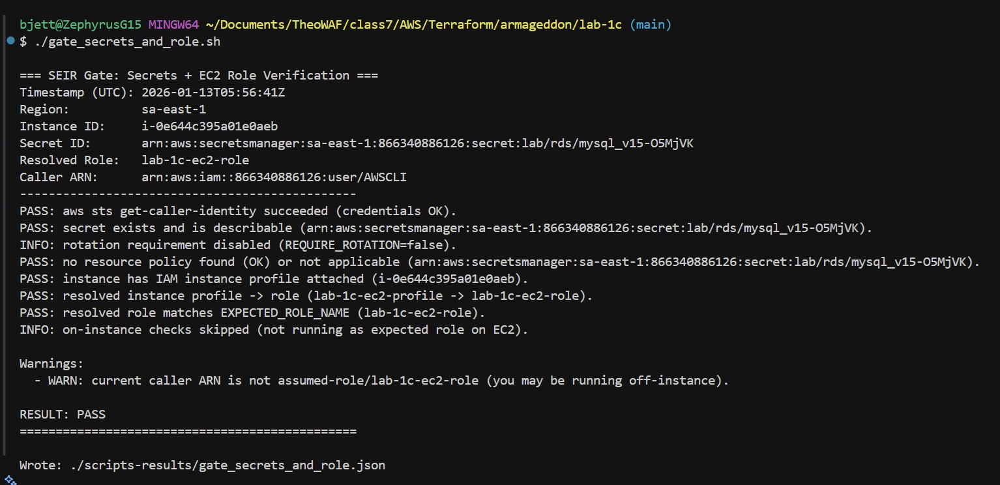

  - **Gate Network and DB screenshot**  
  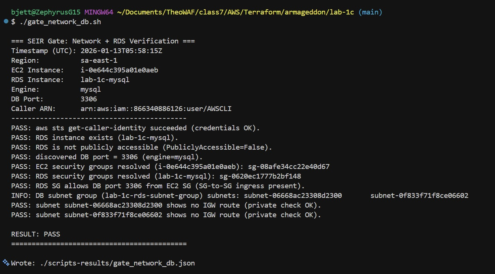

  - **Run all gates screenshots**
  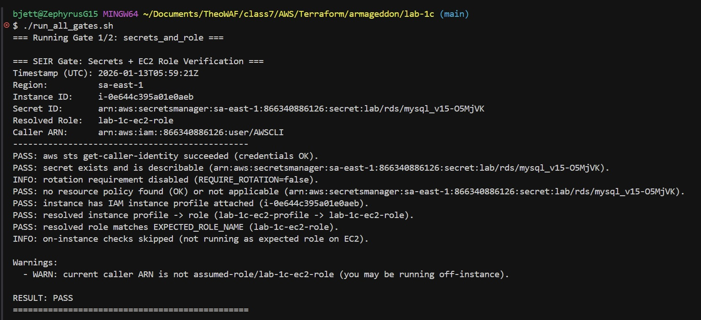
  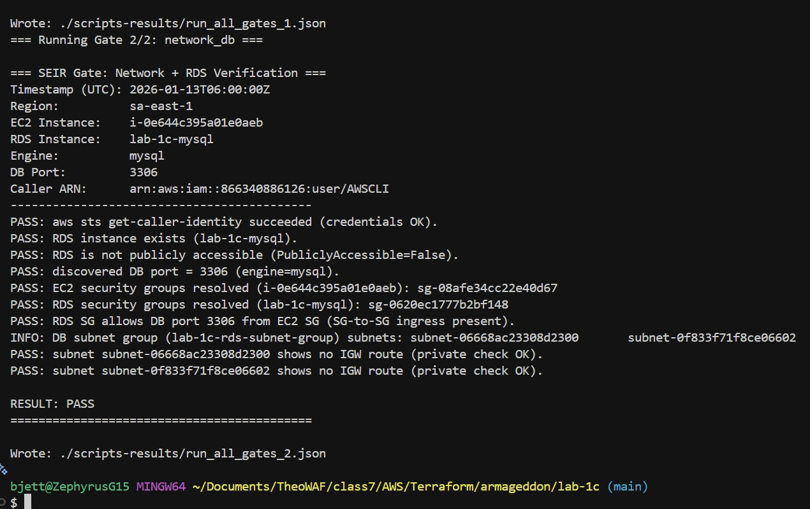

---

Output JSON files appear in `scripts-results/`.

## **Validation & Incident Response (Lab 1B)**

### Post-Deployment Application Tests

- `Note App Initialized`
  - 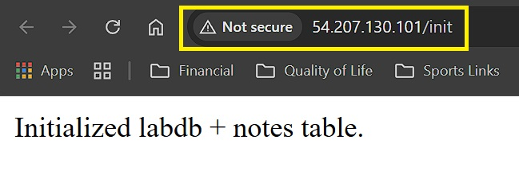
- `Add First Note: first_note`
  - 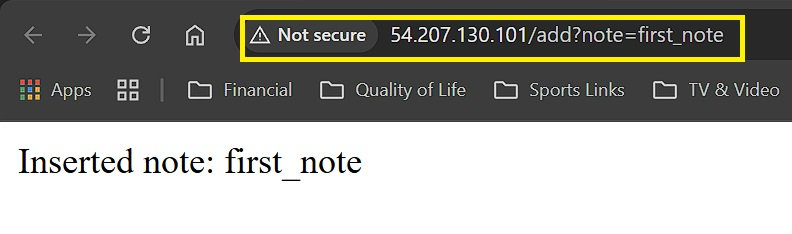
- `Add Second Note: blue_book_gentlemen`
  - 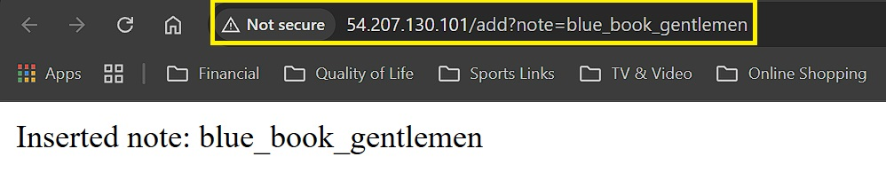
- `Add Third Note: brazil_colombia_capeverde`
  - 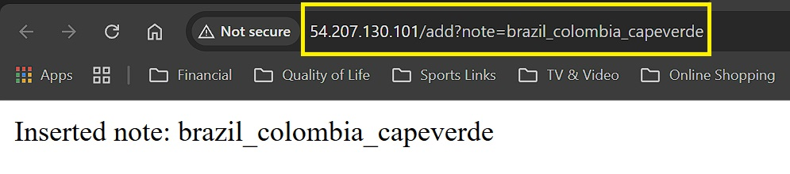
- `Add Fourth Note: this_is_200k_work`
  - 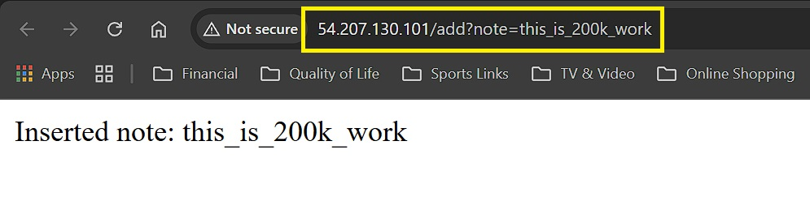
- `Add Fifth Note: lab_1b_is_a_success`
  - 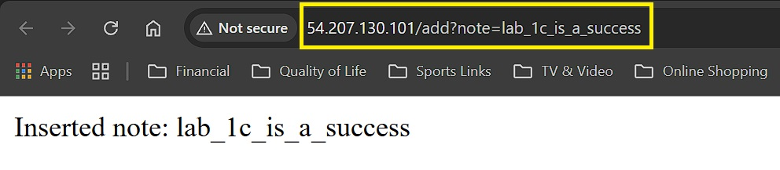
- `List Notes`
  - 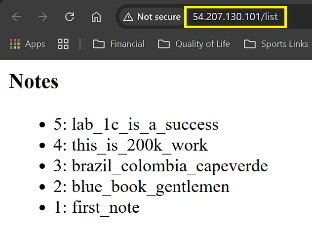

---

### **Configuration Validation**

#### 1.1 - Retrieve database connection parameters from Parameter Store

```bash
# Parameter Store
aws ssm get-parameters \
  --names "/lab/db/endpoint" "/lab/db/port" "/lab/db/name" \
  --with-decryption \
  --region sa-east-1 \
  --output table
```

#### 1.2 - Retrieve full database credentials from Secrets Manager (clean JSON output)

```bash
# Secrets Manager
aws secretsmanager get-secret-value \
  --secret-id "lab/rds/mysql_v15" \
  --region sa-east-1 \
  --query SecretString \
  --output json | jq .
```

#### 2.1 - Subscribe email to SNS topic (only needed once)

```bash
aws sns subscribe \
  --topic-arn arn:aws:sns:sa-east-1:866340886126:lab-1c-db-incidents-v1 \
  --protocol email \
  --notification-endpoint bjett2000@hotmail.com \
  --region sa-east-1
```

#### 2.2 - Verify subscription status (after confirming email link)

```bash
aws sns list-subscriptions-by-topic \
  --topic-arn arn:aws:sns:sa-east-1:866340886126:lab-1c-db-incidents-v1 \
  --region sa-east-1 \
  --query "Subscriptions[?Protocol=='email'].{Endpoint:Endpoint, Status:Status}" \
  --output table
```

  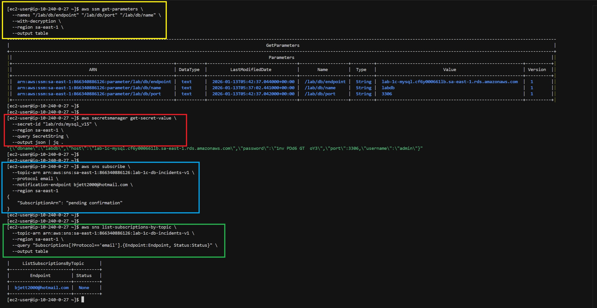
  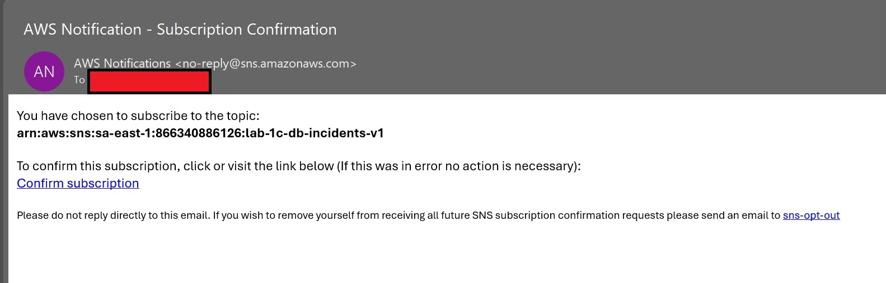
  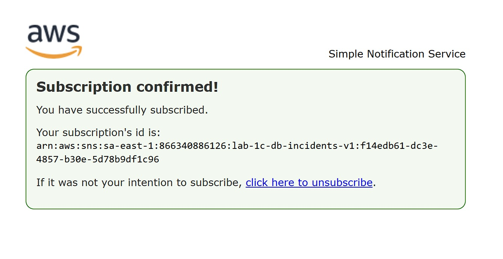

#### 3.1 - Simulate the Incident (Trigger the Alarm)

- **Purpose:** Force a connection failure to generate logs, increment the metric, and trigger the alarm.

- Go to **Secrets Manager** → select your secret (`lab/rds/mysql_v15`) → **Retrieve secret value** → Click **Edit**

  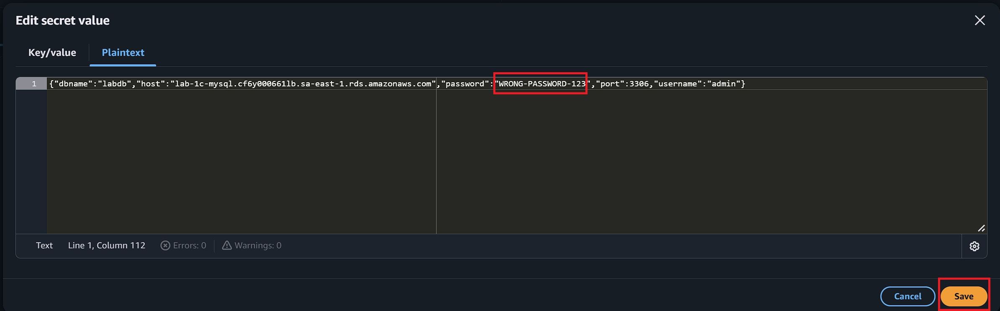

- Click **Save.**

#### 3.2 - View the application failure

- Click **refresh** on the application pages to see connection failures:
  - `http://<PUBLIC_IP>/init`
    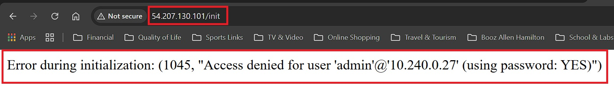
  - `http://<PUBLIC_IP>/add?note=test-failure`
    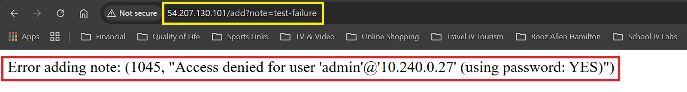
  - `http://<PUBLIC_IP>/list`
    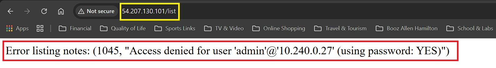

- Wait 5–10 minutes for alarm to trigger and **SNS** notification to arrive.
  - **SNS Notification Email Screenshot: (1 of 2)**
  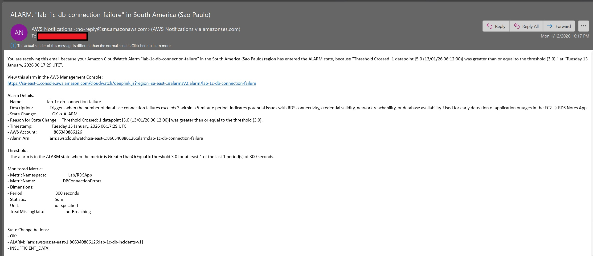
  - **SNS Notification Email Screenshot: (2 of 2)**
  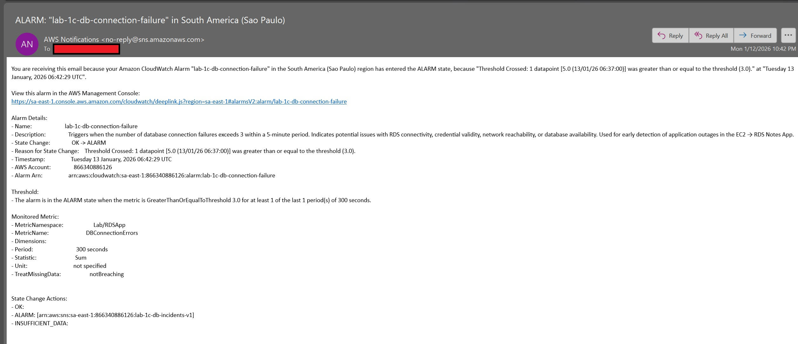

#### 4.1 Acknowledge – Check current alarm state

```bash
aws cloudwatch describe-alarms \
  --alarm-names lab-1c-db-connection-failure \
  --region sa-east-1 \
  --query "MetricAlarms[].StateValue" \
  --output text
```

#### 4.2 Observe – Check recent error logs (last 1 hour)

```bash
aws logs filter-log-events \
  --log-group-name "/aws/ec2/lab-1c-rds-app" \
  --filter-pattern '"Access denied for user"' \
  --region sa-east-1 \
  --start-time "$(date -d '-1 hour' +%s000)" \
  --limit 10 \
  --output json \
| jq -r '.events[] | [(.timestamp / 1000 | todate), .message] | @tsv' \
| sort -n
```

  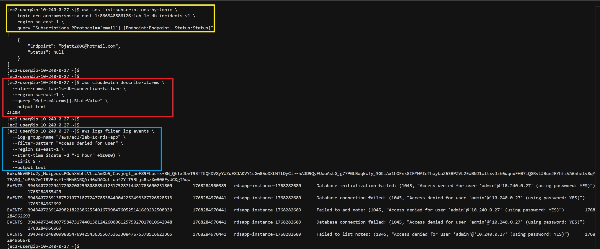

#### 4.3 Validate Configuration Sources (repeat from Section 1.1 & 1.2)

```bash
aws ssm get-parameters \
  --names "/lab/db/endpoint" "/lab/db/port" "/lab/db/name" \
  --with-decryption \
  --region sa-east-1 \
  --output table
```

```bash
aws secretsmanager get-secret-value \
  --secret-id "lab/rds/mysql_v15" \
  --region sa-east-1 \
  --query SecretString \
  --output json | jq .
```

  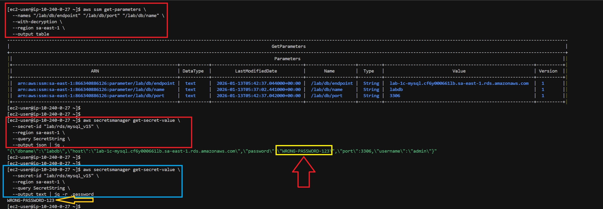

#### 4.4 Diagnosis – Identify credential drift

> Notice the Password in the **Secrets Manager** was incorrect causing credential drift.

#### 4.5 Recovery – Restore the correct password in Secrets Manager

- Apply correct password in Secrets Manager

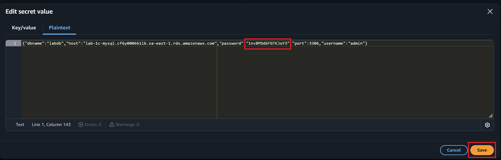

#### 4.5 Post-recovery verification

```bash
# Monitor RDS status until 'available'
aws rds describe-db-instances \
  --db-instance-identifier lab-1c-mysql \
  --region sa-east-1 \
  --query "DBInstances[].DBInstanceStatus" \
  --output text
```

```bash
# Verify application functionality
curl http://<PUBLIC_IP>/list
```

- **Flask App Functional Demo:**
  
  <https://github.com/user-attachments/assets/d8b23074-211e-42fd-bd7f-4d604c3daa1b>

#### 4.6 Confirm alarm clears (wait 5–10 minutes)

```bash
# Monitor CloudWatch alarm state
aws cloudwatch describe-alarms \
  --alarm-names lab-1c-db-connection-failure \
  --region sa-east-1 \
  --query "MetricAlarms[].StateValue" \
  --output text
```

#### 4.7 Confirm logs normalize (no new errors in last 5 minutes)

```bash
# Monitor CloudWatch log events for errors in last 5 minutes
aws logs filter-log-events \
  --log-group-name "/aws/ec2/lab-1c-rds-app" \
  --filter-pattern '"Access denied for user"' \
  --region sa-east-1 \
  --start-time "$(date -d '-5 minutes' +%s000)" \
  --output text
```

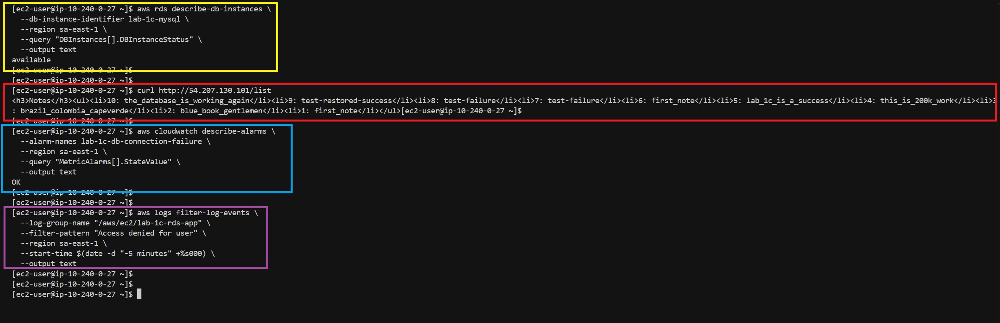

---

## **Terraform Teardown / Cleanup**

```bash
# Preview
terraform destroy -auto-approve
```


  
---

## **Lab 1A Through 1C Deliverables**

| Deliverable | Lab | Screenshot |
| ----------- | --- | ---------- |
| `gate_secrets_and_role.sh` | **1A** |  |
| `gate_network_db.sh` | **1A** |  |
| `run_all_gates.sh` | **1A** |   |
| `lab-1b-pt1.jpg` | **1B** |  |
| `lab-1b-pt2.jpg` | **1B** |  |
| `lab-1b-pt3.jpg` | **1B** |  |
| `lab-1b-pt4.jpg` | **1B** |  |
| `terraform plan` | **1C** |  |
| `terraform apply` | **1C** |  |

---

## **Cloudwatch Logs (Full Version - ASCII)**

- **View Cloudwatch Logs -** [ASCII Format](/scripts-results/cloudwatch.log)

```asc
--------------------------------------------------------------------------------------------------------------------------------
|   timestamp   |                                                   message                                                    |
|---------------|--------------------------------------------------------------------------------------------------------------|
| 1768282689831 | Starting Flask application on port 80                                                                        |
| 1768283008079 | Successfully retrieved database credentials from Secrets Manager                                             |
| 1768283008280 | Database initialized successfully                                                                            |
| 1768283020677 | Successfully retrieved database credentials from Secrets Manager                                             |
| 1768283020680 | Successfully connected to RDS database                                                                       |
| 1768283020686 | Note added successfully: first_note                                                                          |
| 1768283025362 | Successfully retrieved database credentials from Secrets Manager                                             |
| 1768283025364 | Successfully connected to RDS database                                                                       |
| 1768283025366 | Note added successfully: blue_book_gentlemen                                                                 |
| 1768283030780 | Successfully retrieved database credentials from Secrets Manager                                             |
| 1768283030782 | Successfully connected to RDS database                                                                       |
| 1768283030784 | Note added successfully: brazil_colombia_capeverde                                                           |
| 1768283035912 | Successfully retrieved database credentials from Secrets Manager                                             |
| 1768283035915 | Successfully connected to RDS database                                                                       |
| 1768283035917 | Note added successfully: this_is_200k_work                                                                   |
| 1768283036626 | Successfully retrieved database credentials from Secrets Manager                                             |
| 1768283036631 | Database initialized successfully                                                                            |
| 1768283040725 | Successfully retrieved database credentials from Secrets Manager                                             |
| 1768283040727 | Successfully connected to RDS database                                                                       |
| 1768283040729 | Note added successfully: lab_1c_is_a_success                                                                 |
| 1768283046068 | Successfully retrieved database credentials from Secrets Manager                                             |
| 1768283046072 | Successfully connected to RDS database                                                                       |
| 1768283046073 | Successfully retrieved 5 notes                                                                               |
| 1768283053459 | Successfully retrieved database credentials from Secrets Manager                                             |
| 1768283053463 | Successfully connected to RDS database                                                                       |
| 1768283053465 | Note added successfully: first_note                                                                          |
| 1768283075396 | Successfully retrieved database credentials from Secrets Manager                                             |
| 1768283075400 | Successfully connected to RDS database                                                                       |
| 1768283075401 | Successfully retrieved 6 notes                                                                               |
| 1768284955398 | Successfully retrieved database credentials from Secrets Manager                                             |
| 1768284955429 | Database initialization failed: (1045, "Access denied for user 'admin'@'10.240.0.27' (using password: YES)") |
| 1768284962686 | Successfully retrieved database credentials from Secrets Manager                                             |
| 1768284962692 | Database connection failed: (1045, "Access denied for user 'admin'@'10.240.0.27' (using password: YES)")     |
| 1768284962693 | Failed to add note: (1045, "Access denied for user 'admin'@'10.240.0.27' (using password: YES)")             |
| 1768284966662 | Successfully retrieved database credentials from Secrets Manager                                             |
| 1768284966669 | Database connection failed: (1045, "Access denied for user 'admin'@'10.240.0.27' (using password: YES)")     |
| 1768284966670 | Failed to list notes: (1045, "Access denied for user 'admin'@'10.240.0.27' (using password: YES)")           |
| 1768285314532 | Successfully retrieved database credentials from Secrets Manager                                             |
| 1768285314550 | Database initialization failed: (1045, "Access denied for user 'admin'@'10.240.0.27' (using password: YES)") |
| 1768285315574 | Successfully retrieved database credentials from Secrets Manager                                             |
| 1768285315579 | Database initialization failed: (1045, "Access denied for user 'admin'@'10.240.0.27' (using password: YES)") |
| 1768285316433 | Successfully retrieved database credentials from Secrets Manager                                             |
| 1768285316442 | Database initialization failed: (1045, "Access denied for user 'admin'@'10.240.0.27' (using password: YES)") |
| 1768285318508 | Successfully retrieved database credentials from Secrets Manager                                             |
| 1768285318513 | Database connection failed: (1045, "Access denied for user 'admin'@'10.240.0.27' (using password: YES)")     |
| 1768285318514 | Failed to add note: (1045, "Access denied for user 'admin'@'10.240.0.27' (using password: YES)")             |
| 1768285319440 | Successfully retrieved database credentials from Secrets Manager                                             |
| 1768285319447 | Database connection failed: (1045, "Access denied for user 'admin'@'10.240.0.27' (using password: YES)")     |
| 1768285319447 | Failed to add note: (1045, "Access denied for user 'admin'@'10.240.0.27' (using password: YES)")             |
| 1768285320234 | Successfully retrieved database credentials from Secrets Manager                                             |
| 1768285320267 | Database connection failed: (1045, "Access denied for user 'admin'@'10.240.0.27' (using password: YES)")     |
| 1768285320267 | Failed to add note: (1045, "Access denied for user 'admin'@'10.240.0.27' (using password: YES)")             |
| 1768285322702 | Successfully retrieved database credentials from Secrets Manager                                             |
| 1768285322709 | Database connection failed: (1045, "Access denied for user 'admin'@'10.240.0.27' (using password: YES)")     |
| 1768285322710 | Failed to list notes: (1045, "Access denied for user 'admin'@'10.240.0.27' (using password: YES)")           |
| 1768285323509 | Successfully retrieved database credentials from Secrets Manager                                             |
| 1768285323518 | Database connection failed: (1045, "Access denied for user 'admin'@'10.240.0.27' (using password: YES)")     |
| 1768285323518 | Failed to list notes: (1045, "Access denied for user 'admin'@'10.240.0.27' (using password: YES)")           |
| 1768285324373 | Successfully retrieved database credentials from Secrets Manager                                             |
| 1768285324384 | Database connection failed: (1045, "Access denied for user 'admin'@'10.240.0.27' (using password: YES)")     |
| 1768285324385 | Failed to list notes: (1045, "Access denied for user 'admin'@'10.240.0.27' (using password: YES)")           |
| 1768286160154 | Successfully retrieved database credentials from Secrets Manager                                             |
| 1768286160246 | Database initialized successfully                                                                            |
| 1768286163610 | Successfully retrieved database credentials from Secrets Manager                                             |
| 1768286163612 | Successfully connected to RDS database                                                                       |
| 1768286163615 | Note added successfully: test-failure                                                                        |
| 1768286167712 | Successfully retrieved database credentials from Secrets Manager                                             |
| 1768286167715 | Successfully connected to RDS database                                                                       |
| 1768286167721 | Successfully retrieved 7 notes                                                                               |
| 1768286285545 | Successfully retrieved database credentials from Secrets Manager                                             |
| 1768286285549 | Successfully connected to RDS database                                                                       |
| 1768286285551 | Successfully retrieved 7 notes                                                                               |
| 1768286497662 | Successfully retrieved database credentials from Secrets Manager                                             |
| 1768286497680 | Database initialization failed: (1045, "Access denied for user 'admin'@'10.240.0.27' (using password: YES)") |
| 1768286500614 | Successfully retrieved database credentials from Secrets Manager                                             |
| 1768286500620 | Database connection failed: (1045, "Access denied for user 'admin'@'10.240.0.27' (using password: YES)")     |
| 1768286500620 | Failed to add note: (1045, "Access denied for user 'admin'@'10.240.0.27' (using password: YES)")             |
| 1768286503898 | Successfully retrieved database credentials from Secrets Manager                                             |
| 1768286503904 | Database connection failed: (1045, "Access denied for user 'admin'@'10.240.0.27' (using password: YES)")     |
| 1768286503904 | Failed to list notes: (1045, "Access denied for user 'admin'@'10.240.0.27' (using password: YES)")           |
| 1768286539020 | Successfully retrieved database credentials from Secrets Manager                                             |
| 1768286539028 | Database initialization failed: (1045, "Access denied for user 'admin'@'10.240.0.27' (using password: YES)") |
| 1768286539997 | Successfully retrieved database credentials from Secrets Manager                                             |
| 1768286540008 | Database initialization failed: (1045, "Access denied for user 'admin'@'10.240.0.27' (using password: YES)") |
| 1768286540732 | Successfully retrieved database credentials from Secrets Manager                                             |
| 1768286540738 | Database initialization failed: (1045, "Access denied for user 'admin'@'10.240.0.27' (using password: YES)") |
| 1768286543160 | Successfully retrieved database credentials from Secrets Manager                                             |
| 1768286543167 | Database connection failed: (1045, "Access denied for user 'admin'@'10.240.0.27' (using password: YES)")     |
| 1768286543167 | Failed to add note: (1045, "Access denied for user 'admin'@'10.240.0.27' (using password: YES)")             |
| 1768286543901 | Successfully retrieved database credentials from Secrets Manager                                             |
| 1768286543910 | Database connection failed: (1045, "Access denied for user 'admin'@'10.240.0.27' (using password: YES)")     |
| 1768286543910 | Failed to add note: (1045, "Access denied for user 'admin'@'10.240.0.27' (using password: YES)")             |
| 1768286546309 | Successfully retrieved database credentials from Secrets Manager                                             |
| 1768286546316 | Database connection failed: (1045, "Access denied for user 'admin'@'10.240.0.27' (using password: YES)")     |
| 1768286546316 | Failed to list notes: (1045, "Access denied for user 'admin'@'10.240.0.27' (using password: YES)")           |
| 1768286547021 | Successfully retrieved database credentials from Secrets Manager                                             |
| 1768286547027 | Database connection failed: (1045, "Access denied for user 'admin'@'10.240.0.27' (using password: YES)")     |
| 1768286547028 | Failed to list notes: (1045, "Access denied for user 'admin'@'10.240.0.27' (using password: YES)")           |
| 1768287137808 | Successfully retrieved database credentials from Secrets Manager                                             |
| 1768287137817 | Database connection failed: (1045, "Access denied for user 'admin'@'10.240.0.27' (using password: YES)")     |
| 1768287137817 | Failed to list notes: (1045, "Access denied for user 'admin'@'10.240.0.27' (using password: YES)")           |
| 1768287148312 | Successfully retrieved database credentials from Secrets Manager                                             |
| 1768287148320 | Database initialization failed: (1045, "Access denied for user 'admin'@'10.240.0.27' (using password: YES)") |
| 1768287152801 | Successfully retrieved database credentials from Secrets Manager                                             |
| 1768287152810 | Database connection failed: (1045, "Access denied for user 'admin'@'10.240.0.27' (using password: YES)")     |
| 1768287152810 | Failed to add note: (1045, "Access denied for user 'admin'@'10.240.0.27' (using password: YES)")             |
| 1768287202189 | Successfully retrieved database credentials from Secrets Manager                                             |
| 1768287202214 | Database initialized successfully                                                                            |
| 1768287205374 | Successfully retrieved database credentials from Secrets Manager                                             |
| 1768287205376 | Successfully connected to RDS database                                                                       |
| 1768287205378 | Note added successfully: test-failure                                                                        |
| 1768287208810 | Successfully retrieved database credentials from Secrets Manager                                             |
| 1768287208813 | Successfully connected to RDS database                                                                       |
| 1768287208816 | Successfully retrieved 8 notes                                                                               |
| 1768287370087 | Successfully retrieved database credentials from Secrets Manager                                             |
| 1768287370093 | Successfully connected to RDS database                                                                       |
| 1768287370093 | Successfully retrieved 8 notes                                                                               |
| 1768287372447 | Successfully retrieved database credentials from Secrets Manager                                             |
| 1768287372450 | Successfully connected to RDS database                                                                       |
| 1768287372451 | Successfully retrieved 8 notes                                                                               |
| 1768287373147 | Successfully retrieved database credentials from Secrets Manager                                             |
| 1768287373149 | Successfully connected to RDS database                                                                       |
| 1768287373150 | Successfully retrieved 8 notes                                                                               |
| 1768287373858 | Successfully retrieved database credentials from Secrets Manager                                             |
| 1768287373860 | Successfully connected to RDS database                                                                       |
| 1768287373861 | Successfully retrieved 8 notes                                                                               |
| 1768287419219 | Successfully retrieved database credentials from Secrets Manager                                             |
| 1768287419222 | Successfully connected to RDS database                                                                       |
| 1768287419224 | Note added successfully: test-restored-success                                                               |
| 1768287466330 | Successfully retrieved database credentials from Secrets Manager                                             |
| 1768287466334 | Successfully connected to RDS database                                                                       |
| 1768287466334 | Successfully retrieved 9 notes                                                                               |
| 1768287539384 | Successfully retrieved database credentials from Secrets Manager                                             |
| 1768287539387 | Successfully connected to RDS database                                                                       |
| 1768287539389 | Note added successfully: the_database_is_working_again                                                       |
| 1768287594419 | Successfully retrieved database credentials from Secrets Manager                                             |
| 1768287594423 | Successfully connected to RDS database                                                                       |
| 1768287594424 | Successfully retrieved 10 notes                                                                              |
| 1768287665377 | Successfully retrieved database credentials from Secrets Manager                                             |
| 1768287665383 | Successfully connected to RDS database                                                                       |
| 1768287665384 | Successfully retrieved 10 notes                                                                              |
--------------------------------------------------------------------------------------------------------------------------------
```

## **References**

- **AWS CLI Reference -**  
  <https://docs.aws.amazon.com/cli/latest/reference/>
- **AWS RDS Metrics Documentation -**  
  <https://docs.aws.amazon.com/AmazonRDS/latest/UserGuide/rds-metrics.html>
- **CloudWatch Logs Filter Pattern Syntax -**  
  <https://docs.aws.amazon.com/AmazonCloudWatch/latest/logs/FilterAndPatternSyntax.html>
- **Terraform AWS Provider -**  
  <https://registry.terraform.io/providers/hashicorp/aws/latest/docs>
- **Watchtower – Python CloudWatch Logs Handler**  
  <https://github.com/kislyuk/watchtower>

---

## **Troubleshooting**

- **Terraform errors** → `terraform validate`, check `.terraform.lock.hcl`
- **Application 500** → `sudo journalctl -u rdsapp -n 100`, verify secrets
- **No CloudWatch Logs** → Confirm IAM `logs:CreateLogStream`, `PutLogEvents`
- **Alarm not triggering** → Verify metric filter pattern matches log messages
- **SSH denied** → Update **EC2 SG** inbound rule with current public IP

---

## **Author**

- **Author:** T.I.Q.S.
- **Group Leader:** John Sweeney

---
