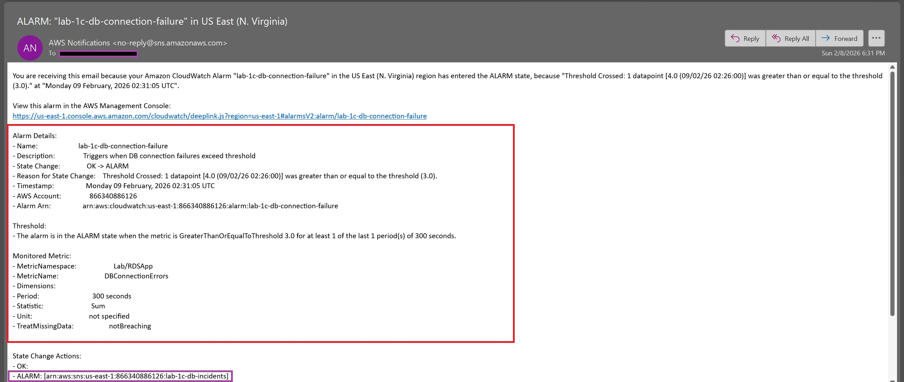
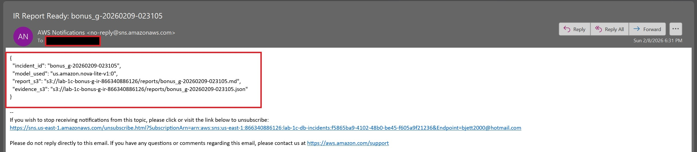

# 🤖 AWS Armageddon – Lab 1C Bonus G  


---

## 📌 Task Overview

**Bonus G** implements a **real-world Auto-Incident-Response (Auto-IR) pipeline** that mirrors how modern security and SRE teams operate:

> **Alarm → Evidence Collection → LLM Analysis → Report Artifact → Notification**

Using **Amazon Bedrock**, this lab automatically generates **human-readable incident reports** whenever a critical event occurs — eliminating manual log-digging during outages.

---

## 🎯 Task Objectives

- Trigger Auto-IR from **SNS / CloudWatch alarms**
- Collect **WAF + application evidence** using Logs Insights
- Generate **Markdown + JSON incident reports** using Bedrock
- Store reports in **S3** for audit and grading
- Notify responders via **SNS**
- Support **primary + fallback Bedrock models** for reliability

---

## 📋 Task Requirements

- Existing WAF + application logging (from prior labs)
- CloudWatch Logs Insights queries
- Amazon Bedrock Runtime access
- Terraform-managed Lambda, IAM, S3, SNS
- Evidence **must be redacted** (no secrets in reports)

---

## 🧱 Project Structure

```plaintext
lab-1c-bonus-g/
├── lambda/
│   └── incident_reporter/
│       ├── handler.py
│       ├── claude.py
│       └── bonus_g_bedrock_template.md
│   └── incident_reporter.zip
│
├── Screenshots/
│   ├── bonus_g-20260208-225214.json
│   ├── bonus_g-20260208-225214.md
│   ├── ir-report-sns-notification.jpg
│   ├── sns-db-connection-failure-1.jpg
│   └── sns-db-connection-failure-2.jpg
│
├── scripts/
│   ├── gate_network_db.sh
│   ├── gate_secrets_and_role.sh
│   ├── run_all_gates.sh
│   └── user_data.sh
│
├── scripts-results/
│   ├── gate_network_db.json
│   ├── gate_secrets_and_role.json
│   ├── run_all_gates_1.json
│   └── run_all_gates_2.json
│
├── .gitignore
├── 1-versions.tf
├── 2-providers.tf
├── 3-locals.tf
├── 4-main.tf
├── 5-variables.tf
├── 6-route53.tf
├── 7-cw-insight-queries.tf
├── 8-bedrock.tf
├── 9-outputs.tf
├── README.md
└── STEPS.md
```

---

## 🚀 Terraform Deployment

```bash
terraform init
terraform fmt
terraform validate
terraform plan
terraform apply
```


---

## 🖼️ Screenshots

> 📸 Included evidence:

- **SNS Notification for Password changed in Secrets Manager:**


- **IR Report Complete via SNS Notification:**


---

## 📦 Deliverables

- [**Initial IR Report Markdown**](Screenshots/bonus_g-20260209-023105.md)
- [**Initial Evidence Bundle JSON**](Screenshots/bonus_g-20260209-023105.json)
- [**Complete IR Report Markdown**](Screenshots/bonus_g-20260209-023502.md)
- [**Complete Evidence Bundle JSON**](Screenshots/bonus_g-20260209-023502.json)
- [**CloudWatch Logs for RDSApp**](Screenshots/rdsapp-cw-logs.csv)

---

## 🧠 Why This Matters

Bonus G demonstrates **production-grade incident response automation**:

- No manual log scraping
- No copy-pasting during outages
- Deterministic, auditable incident reports
- Extensible foundation for:

  - Bedrock Agents
  - Knowledge Bases
  - Preventive remediation

This is **how real orgs scale SRE and security operations**.

---

## Teardown

```bash
terraform destroy
```

---

## 📚 References

- **Amazon Bedrock Runtime**
  [https://docs.aws.amazon.com/bedrock/latest/userguide/inference-invoke.html](https://docs.aws.amazon.com/bedrock/latest/userguide/inference-invoke.html)
- **CloudWatch Logs Insights**
  [https://docs.aws.amazon.com/AmazonCloudWatch/latest/logs/AnalyzingLogData.html](https://docs.aws.amazon.com/AmazonCloudWatch/latest/logs/AnalyzingLogData.html)
- **AWS WAF Logging**
  [https://docs.aws.amazon.com/waf/latest/developerguide/logging.html](https://docs.aws.amazon.com/waf/latest/developerguide/logging.html)

---

## 🧯 Troubleshooting

- **Bedrock model access denied?**

  - Complete provider use-case form in Bedrock console
  - Verify region alignment

- **Fallback model used?**

  - Check Lambda logs for model selection
  - Confirm primary model lifecycle status

---

## 👤 Author

- **Author:** T.I.Q.S.
- **Group Leader:** John Sweeney

---
