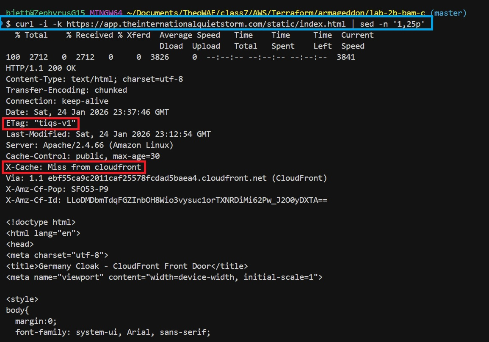
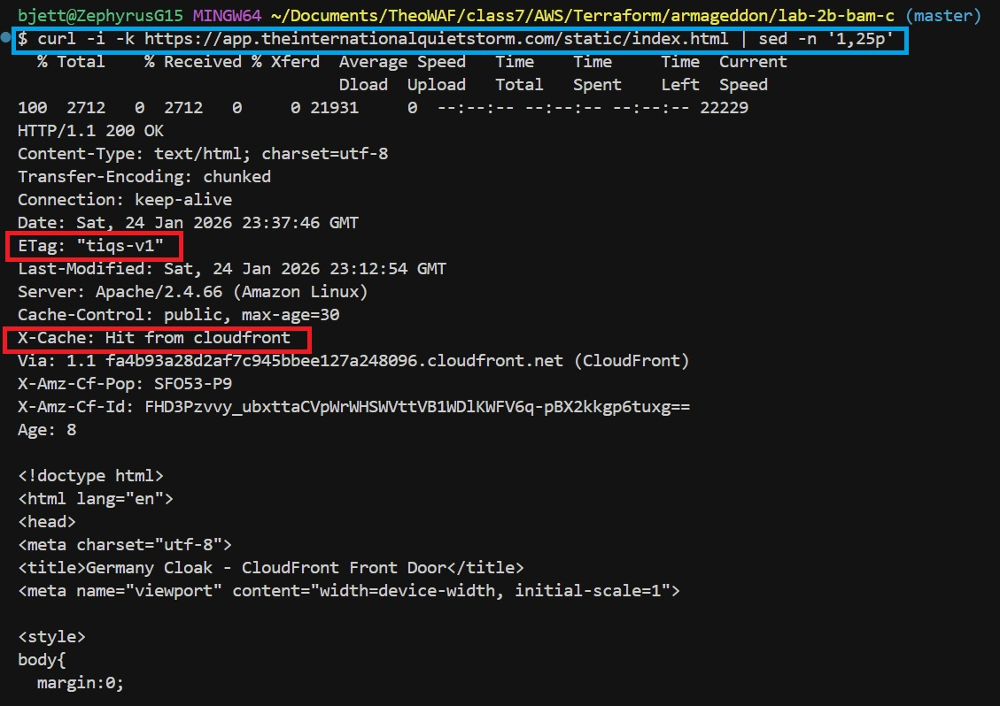
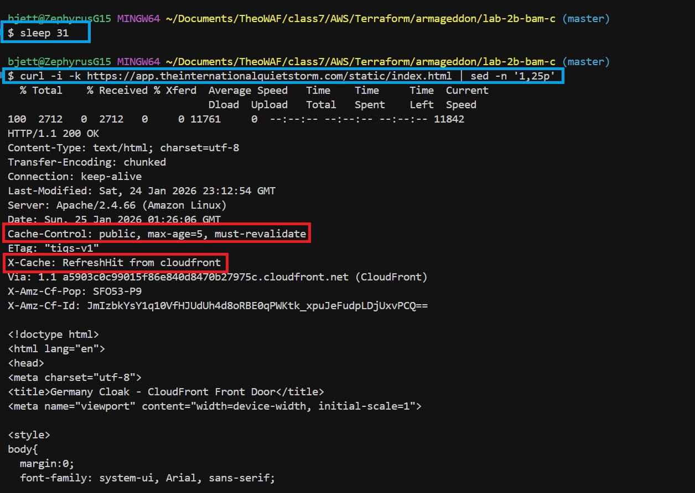

# 🛡️ AWS Lab 2B (BAM C) - Honors ++

---


---

## 📌 Task Overview

This lab demonstrates **advanced CDN caching behavior** using AWS CloudFront, focusing on **conditional requests and revalidation**. The goal is to prove that CloudFront can reuse cached objects via validators (`ETag`, `Last-Modified`) after TTL expiry, resulting in **`RefreshHit from cloudfront`** instead of a full origin fetch.

This challenge goes beyond basic caching to show **protocol-level correctness**, **origin/CDN coordination**, and **real-world performance tradeoffs**.

---

## 🎯 What This Lab Teaches (One Sentence)

A CDN can revalidate cached objects using conditional requests—saving bandwidth and preserving correctness—and `RefreshHit` is expected, healthy behavior.

---

## 🧠 Mental Model

| `x-cache` Value              | Meaning                                                               |
| ---------------------------- | --------------------------------------------------------------------- |
| `Miss from cloudfront`       | Object fetched fully from origin                                      |
| `Hit from cloudfront`        | Object served entirely from edge cache                                |
| `RefreshHit from cloudfront` | TTL expired; CDN revalidated with origin (304) and reused cached body |
| `Error from cloudfront`      | Edge or origin failure                                                |

---

## 📋 Task Requirements

### Origin Requirements

* Static endpoint
* Cacheable response
* Validators present:

  * `ETag`
  * `Last-Modified`
* Cache headers:

  * `Cache-Control: public, max-age=5, s-maxage=5`

### CloudFront Requirements

* `/static/*` cache behavior
* CDN caching enabled
* Cache policy supports revalidation
* Distribution deployed and serving traffic

---

## 🧩 Project Structure

```plaintext
lab-2b-bam-c/
├── Screenshots/
│   ├── lab-2b-bam-c-demo.mp4
│   ├── lab-2b-bam-c-pt1.jpg
│   ├── lab-2b-bam-c-pt2.jpg
│   ├── lab-2b-bam-c-pt3.jpg
│   ├── terraform-apply.jpg
│   ├── terraform-destroy.jpg
│   ├── terraform-init-fmt-validate.jpg
│   └── terraform-plan.jpg
|
├── .gitignore
├── .terraform.lock.hcl
├── 1-versions.tf
├── 2-providers.tf
├── 3-locals.tf
├── 4-main.tf
├── 5-variables.tf
├── 6-outputs.tf
├── README.md
├── user_data.sh
└── WRITTEN.md
```

---

## 🚀 Terraform Deployment Steps

```bash
terraform init
terraform validate
terraform plan
terraform apply
```


Wait for CloudFront status to become **Deployed** before testing.

---

 Lab 2B Challenge C Demo Video:

<https://github.com/user-attachments/assets/cace6205-e453-4843-9141-5d9ae1f08a97>

---

## 🔍 Verification (Honors++)

### 1️⃣ Prime Cache (Cold)

```bash
curl -i -k https://app.theinternationalquietstorm.com/static/index.html \
| sed -n '1,25p'
```

Expected:



---

### 2️⃣ Confirm Cache Hit

```bash
curl -i -k https://app.theinternationalquietstorm.com/static/index.html \
| sed -n '1,25p'
```

Expected:



---

### 3️⃣ TTL Expiry → RefreshHit

```bash
sleep 31
curl -i -k https://app.theinternationalquietstorm.com/static/index.html \
| sed -n '1,25p'
```

Expected:



---

## 🧹 Terraform Teardown

```bash
terraform destroy
```


Confirm CloudFront distribution deletion completes successfully.

---

## 🛠️ Troubleshooting

| Symptom            | Cause               | Fix                              |
| ------------------ | ------------------- | -------------------------------- |
| Always Miss        | Cache disabled      | Use managed cache policy         |
| No RefreshHit      | No validators       | Add `ETag` / `Last-Modified`     |
| Stale content      | Validator unchanged | Update `ETag` or `Last-Modified` |
| Using invalidation | Overuse             | Fix origin headers instead       |

---

## 📚 References

* **AWS CloudFront Cache Behaviors** - [https://docs.aws.amazon.com/AmazonCloudFront/latest/DeveloperGuide/HowCloudFrontWorks.html](https://docs.aws.amazon.com/AmazonCloudFront/latest/DeveloperGuide/HowCloudFrontWorks.html)

* **HTTP Conditional Requests (RFC 9110)** - [https://www.rfc-editor.org/rfc/rfc9110.html](https://www.rfc-editor.org/rfc/rfc9110.html)

* **CloudFront Cache Policies** - [https://docs.aws.amazon.com/AmazonCloudFront/latest/DeveloperGuide/controlling-the-cache-key.html](https://docs.aws.amazon.com/AmazonCloudFront/latest/DeveloperGuide/controlling-the-cache-key.html)

* **AWS Managed Cache Policies** - [https://docs.aws.amazon.com/AmazonCloudFront/latest/DeveloperGuide/using-managed-cache-policies.html](https://docs.aws.amazon.com/AmazonCloudFront/latest/DeveloperGuide/using-managed-cache-policies.html)

---

## 👤 **Authors**

* **Author:** T.I.Q.S.
* **Group Leader:** John Sweeney

---
