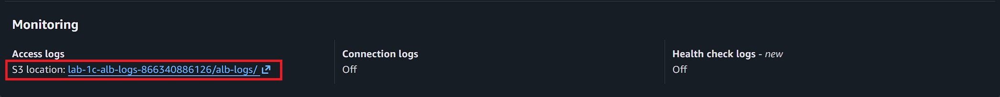
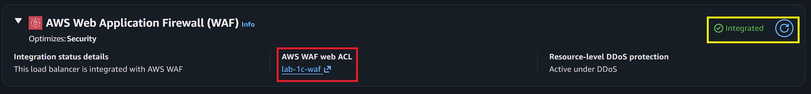
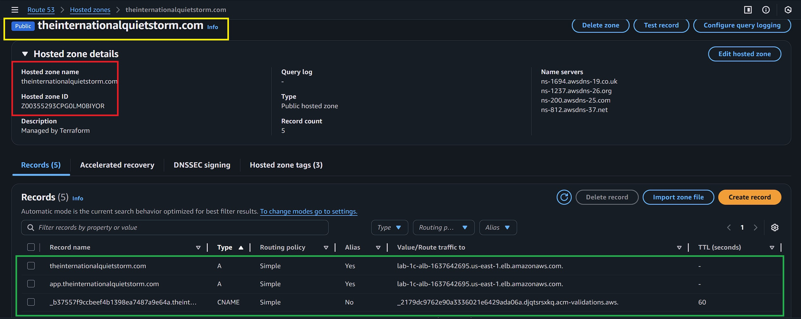

# 🛡️ AWS Lab 1C (Bonus C + Bonus D)


---

## 📌 Task Overview

This lab implements a **real-world enterprise ingress pattern** using Terraform:

- **Private EC2 compute** (no public IPs)
- **Public Application Load Balancer (ALB)** as the only ingress
- **TLS via AWS Certificate Manager (ACM)**
- **Authoritative DNS via Route53**
- **Infrastructure as Code (IaC)** with Terraform

The final result exposes the application securely over **HTTPS** while keeping compute fully private.

---

## 🎯 Task Requirements

### Core Requirements

- **Private EC2 instances** (no public IPs)
- Internet-facing **Application Load Balancer**
- **HTTPS** listener on port 443
- Valid ACM certificate (`ISSUED`)
- **Route53** **DNS** record pointing to the ALB
- Terraform-managed infrastructure

### Bonus / Enterprise Practices

- Reuse existing hosted zone (no zone creation)
- **Alias A record** at apex/root domain
- Wildcard certificate reuse where applicable
- Clean **DNS** delegation
- Least-privilege access patterns

### Bonus D — Enterprise Observability + DNS Realism

- **Zone apex (root) domain** ALIAS record → **Application Load Balancer**
- **ALB access logging enabled** and delivered to **Amazon S3**

- Secure **bucket policy** enforcing:
  - TLS-only access
  - Correct service principal
  - Bucket-owner control of log objects

- Terraform-controlled logging (no console clicks)

- CLI-verifiable evidence for:
  - DNS resolution
  - ALB logging configuration
  - Log delivery to **S3**

---

## 🗂️ Project Structure

```plaintext
lab-1c-bonus-d/
├── Screenshots/
|   ├── alb-log-monitoring.jpg
|   ├── alb-waf-config.jpg
|   ├── bonus-c-pt1.jpg
|   ├── bonus-c-pt2.jpg
|   ├── bonus-d-pt1.jpg
|   ├── bonus-d-pt2.jpg
|   ├── bonus-d-pt3.jpg
|   ├── bonus-d-pt4.jpg
|   ├── route53-hosted-zone.jpg
|   ├── s3-logs.jpg
|   ├── terraform-apply.jpg
|   ├── terraform-destroy.jpg
|   ├── terraform-init-fmt-validate.jpg
|   └── terraform-plan.jpg
|
├── scripts/
|   └── user_data.sh
|
├── .gitignore
├── 1-versions.tf
├── 2-providers.tf
├── 3-locals.tf
├── 4-main.tf
├── 5-variables.tf
├── 6-route53.tf
├── 7-outputs.tf
├── README.md
└── STEPS.md
```

---

## 🚀 Terraform Deployment Steps

```bash
terraform init
terraform fmt
terraform validate
terraform plan
terraform apply
```


> Apply provisions networking, security groups, ALB, EC2, **DNS** records, and TLS integration.

---

## ✅ Screenshots

|Deliverable                 |Description                                                       |Screenshot                                                   |
|----------------------------|------------------------------------------------------------------|-------------------------------------------------------------|
|`bonus-c-pt1.jpg`           |Route53 Hosted Zone and Record Sets                               |                  |
|`bonus-c-pt2.jpg`           |ACM certificate issued and **DNS** record created                 |                  |
|`bonus-d-pt1.jpg`           |ALB access logging enabled via Terraform                          |                  |
|`bonus-d-pt2.jpg`           |**S3** bucket policy enforcing secure log delivery                |                  |
|`bonus-d-pt3.jpg`           |ALB access logs delivered to **S3** (CLI verification)            |                  |
|`bonus-d-pt4.jpg`           |ALB access logs delivered to **S3** (**S3** console verification) |                  |
|`alb-log-monitoring.jpg`    |ALB access logs in **S3** bucket (**S3** console)                 |    |
|`S3-logs.jpg`               |ALB access logs delivered to **S3** (Bonus D proof)               |                          |
|`alb-waf-config.jpg`        |ALB WAFv2 configuration (Bonus D proof)                           |            |
|`route53-hosted-zone.jpg`   |Route53 hosted zone initialization                                |  |

---

## 🧠 Additional Information

- **ALB Access Logs (Bonus D)**:  
  Application Load Balancer access logs are written to **Amazon S3** and provide
  **incident-response-grade telemetry**, including:
  - Client IP addresses
  - Request paths
  - Target response codes
  - Latency and backend behavior

  These logs are critical when correlating:
  - ALB 5xx spikes
  - WAF blocks
  - Application errors

---

## 🧪 Verification (Bonus C + Bonus D)

See **[STEPS.md](STEPS.md)** for CLI verification commands validating:

- Route53 hosted zone and apex record
- ACM certificate issuance
- HTTPS reachability
- **ALB access logging enabled**
- **Log delivery into S3**

---

## 🧹 Teardown Instructions

```bash
terraform destroy
```

  

> Save/Delete your ALB logs in your **S3** bucket before destroying to avoid data loss.

---

## 🧠 Troubleshooting

### **DNS does not resolve**

- Verify registrar nameservers match **Route53** NS records
- Disable DNSSEC during delegation changes
- Use `dig NS <domain>` to confirm authority

### **HTTPS fails**

- Confirm certificate status is `ISSUED`
- Ensure certificate matches hostname
- Remember: wildcard certs do **not** cover apex domains

### **Terraform errors**

- Run `terraform validate`
- Check for dangling references to removed resources

---

## 📚 References

- [What is an Application Load Balancer?](https://docs.aws.amazon.com/elasticloadbalancing/latest/application/introduction.html)
- [Routing traffic to an ELB load balancer?](https://docs.aws.amazon.com/Route53/latest/DeveloperGuide/routing-to-elb-load-balancer.html)
- [What is AWS Certificate Manager?](https://docs.aws.amazon.com/acm/latest/userguide/acm-overview.html)
- [Terraform Documentation](https://developer.hashicorp.com/terraform/docs)

---

## 👥 **Authors**

- **Author:** T.I.Q.S.
- **Group Leader:** John Sweeney
