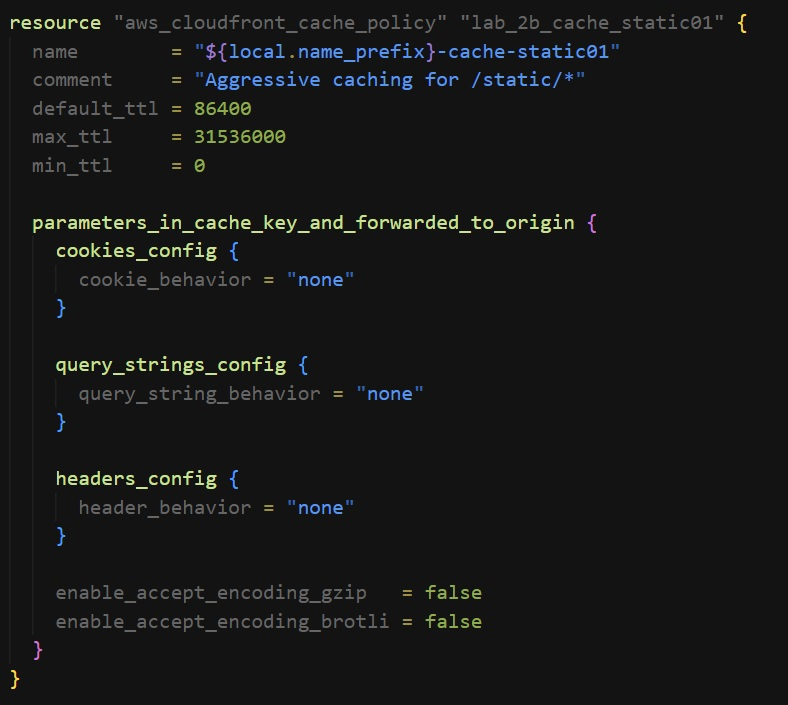
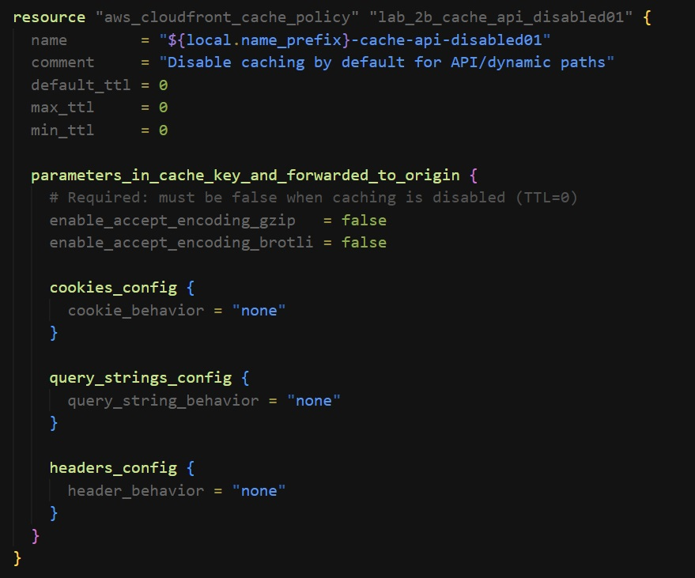
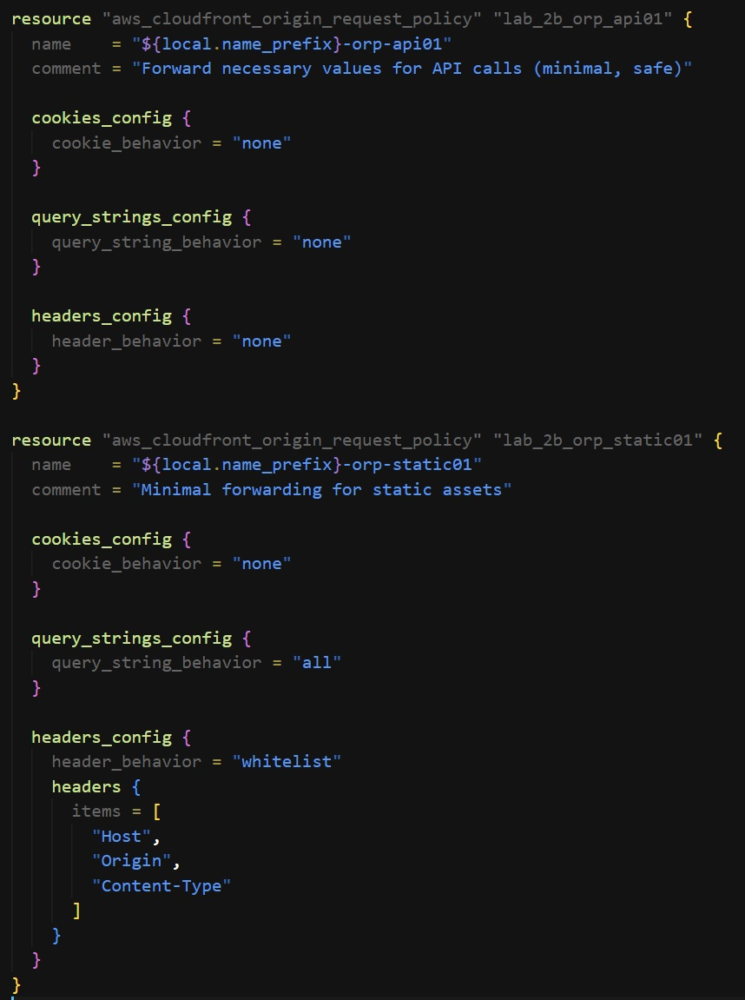
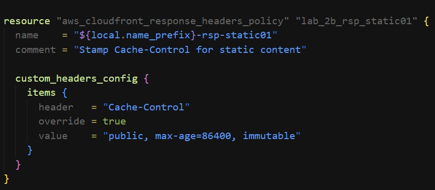
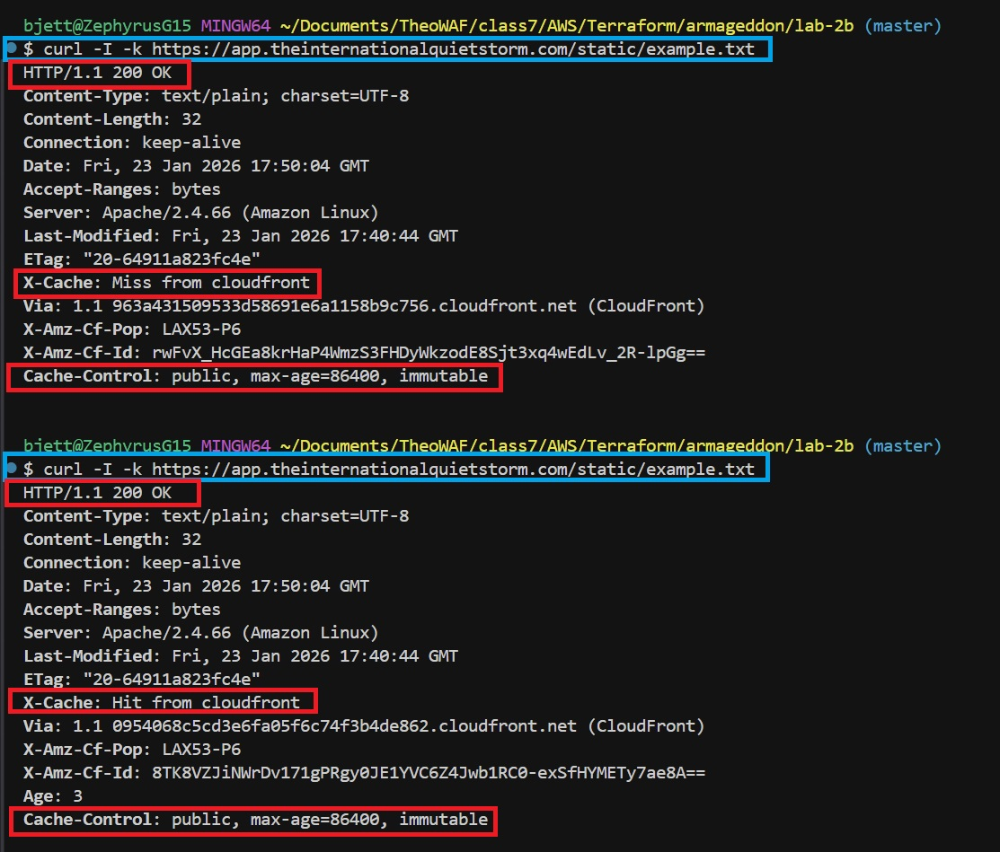
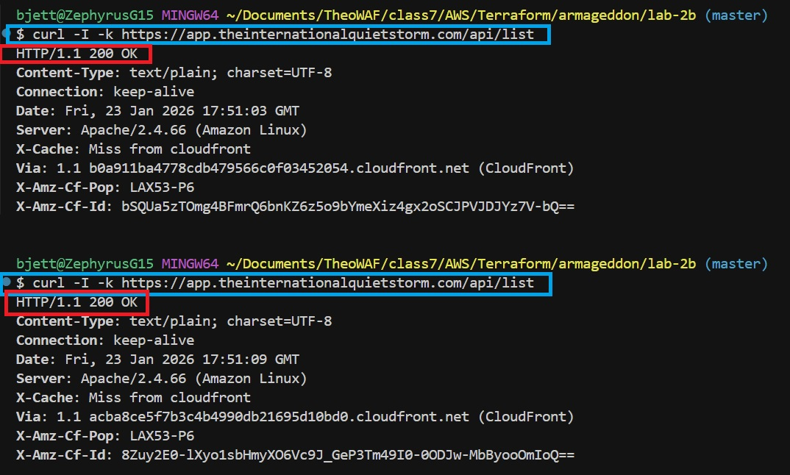
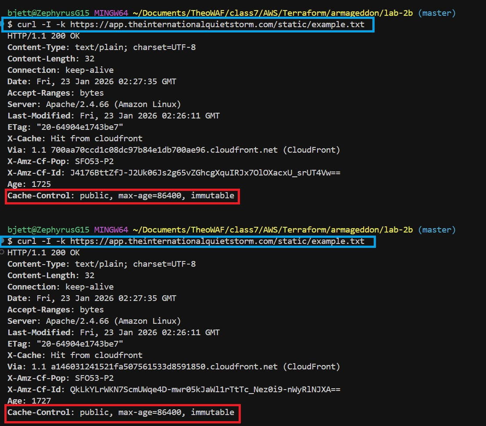
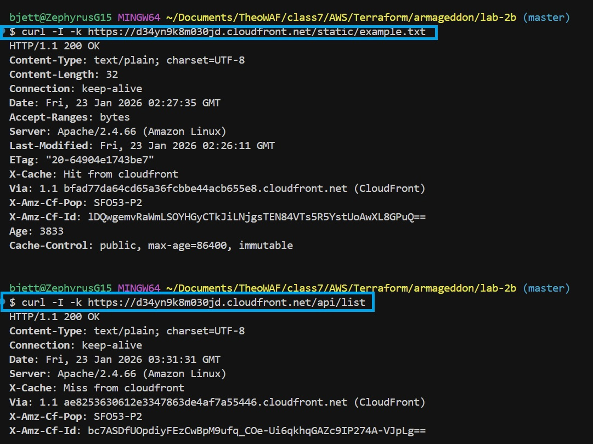
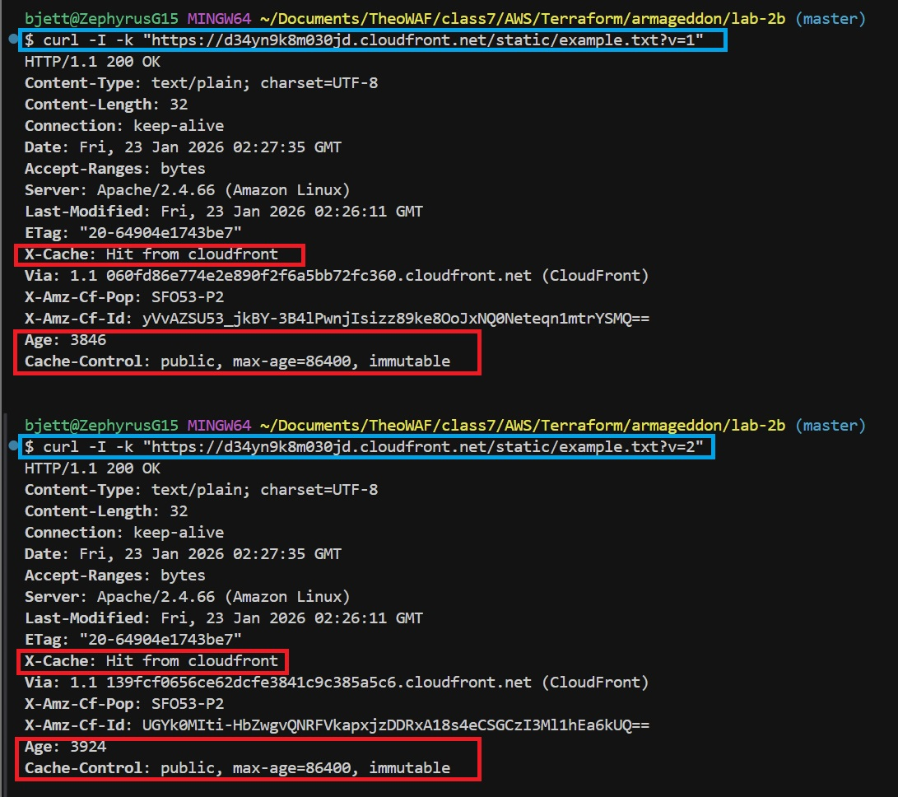
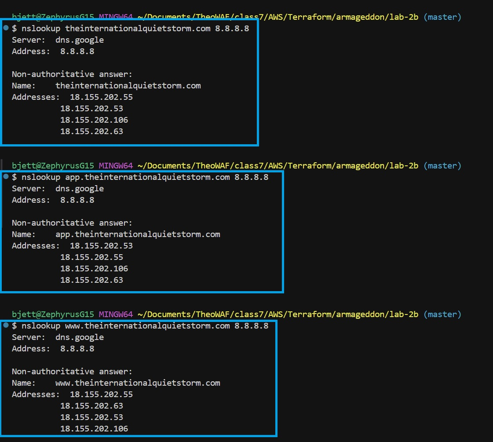

# 🛡️ Lab 2B — CloudFront + API Caching Correctness


---

## 📌 Task Overview

This lab implements a **production-grade Amazon CloudFront architecture** that demonstrates **correct CDN caching behavior** for both static and dynamic content.

The design focuses on **correctness over convenience**, explicitly preventing common CDN failure modes such as session mixups, stale reads, and cache fragmentation.

Key objectives:

- Aggressively cache static content for performance and cost efficiency
- Safely disable caching for API responses by default
- Separate **cache key composition** from **origin request forwarding**
- Prove correctness using HTTP response headers (`Age`, `X-Cache`, `Cache-Control`)

---

## 🏗️ Architecture Diagram

The following diagram illustrates the complete Lab 2B architecture, including CloudFront behaviors, cache policies, and origin flow.



**Highlights:**

- Route 53 routes all domains to CloudFront
- CloudFront applies **distinct behaviors** for `/static/*` and `/api/*`
- Static content is cached at the edge
- API responses bypass cache and always reach the origin
- ALB and EC2 serve as the origin layer

---

## 📋 Task Requirements

- Two cache policies:
  - Static (aggressive caching)
  - API (caching disabled / safe default)
- Two origin request policies:
  - Static (forward nothing)
  - API (forward only required headers/query strings)
- Two cache behaviors:
  - `/static/*`
  - `/api/*`
- Response headers policy enforcing explicit `Cache-Control`

---

## 📄 Project Structure

```plaintext
lab-2b/
├── Screenshots/
│   ├── lab-2b-deliverable-a-pt1.jpg
│   ├── lab-2b-deliverable-a-pt2.jpg
│   ├── lab-2b-deliverable-a-pt3.jpg
│   ├── lab-2b-deliverable-a-pt4.jpg
│   ├── lab-2b-deliverable-b-pt1.jpg
│   ├── lab-2b-deliverable-b-pt2.jpg
│   ├── lab-2b-deliverable-bam-challenge.jpg
│   ├── lab-2b-deliverable-d-pt1.jpg
│   ├── lab-2b-deliverable-d-pt2.jpg
│   ├── lab-2b-deliverable-d-pt3.jpg
├── .gitignore
├── 1-versions.tf          # Terraform versioning
├── 2-providers.tf         # AWS provider configuration
├── 3-locals.tf            # Local variables
├── 4-main.tf              # Core infrastructure (CloudFront, ALB, EC2)
├── 5-variables.tf         # Input variables
├── 6-outputs.tf           # Terraform outputs
├── germany.sh             # Apache bootstrap / test endpoints
├── README.md              # Project documentation
├── STEPS.md               # CLI commands for all deliverables
└── WRITTEN.md             # Written analysis and failure scenarios
````

---

## 🛠️ Terraform Deployment Steps

```bash
terraform init
terraform fmt
terraform validate
terraform plan
terraform apply
```


---

## 🗾 Deliverables Mapping

| Deliverable | Description                                            | Screenshot Reference                                                                      |
|-------------|--------------------------------------------------------|-------------------------------------------------------------------------------------------|
| A           | CloudFront static and API distribution                 |                  |
| A           | CloudFront disabled caching                            |                  |
| A           | CloudFront request policy configuration                |                  |
| A           | CloudFront response policy configuration               |                  |
| B           | Cache and origin request example.txt                   |                  |
| B           | Cache and origin request api/list                      |                  |
| BAM         | Be A Man Challenge                                     |  |
| D           | Curl correctness proof for static and API paths        |                  |
| D           | Curl correctness proof for static and API paths        |                  |
| D           | nslookup correctness proof for static and API paths    |                  |

---

## 🧹 Teardown

```bash
terraform destroy
```


---

## 📝 References

- [Understanding the Cache Key](https://docs.aws.amazon.com/AmazonCloudFront/latest/DeveloperGuide/understanding-the-cache-key.html)
- [Controlling the Cache Key](https://docs.aws.amazon.com/AmazonCloudFront/latest/DeveloperGuide/controlling-the-cache-key.html)
- [Using Managed Cache Policies](https://docs.aws.amazon.com/AmazonCloudFront/latest/DeveloperGuide/using-managed-cache-policies.html)
- [Controlling Origin Requests](https://docs.aws.amazon.com/AmazonCloudFront/latest/DeveloperGuide/controlling-origin-requests.html)
- [Understanding How Origin Request Policies and Cache Policies Work Together](https://docs.aws.amazon.com/AmazonCloudFront/latest/DeveloperGuide/understanding-how-origin-request-policies-and-cache-policies-work-together.html)

---

## 🔧 Troubleshooting

- Local DNS resolution failures (corporate/VPN resolvers)
- Windows TLS handshake errors (SChannel)
- Cache fragmentation due to high-cardinality cache keys
- Origin 403 errors from over-forwarding headers

---

## 👥 Authors

- **Author:** T.I.Q.S.
- **Group Leader:** John Sweeney
