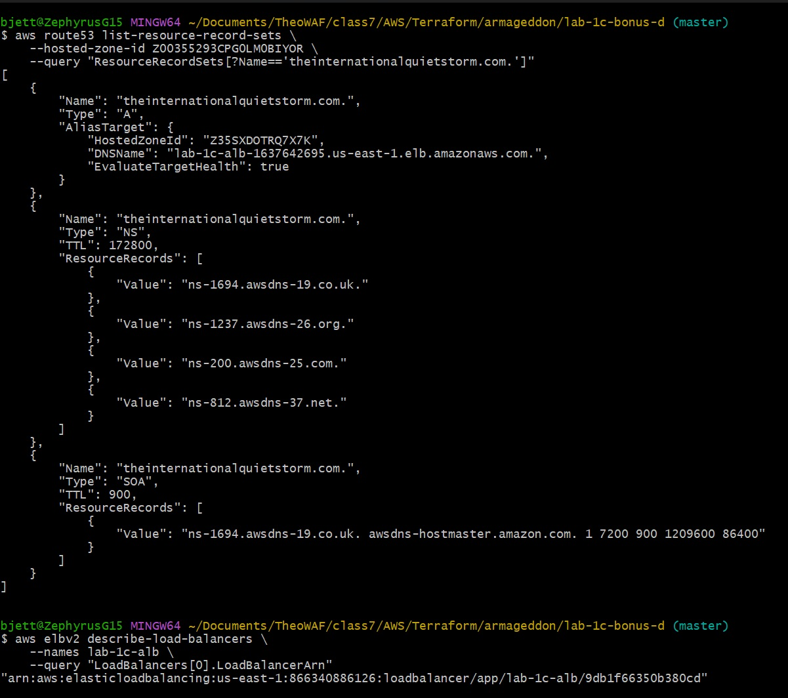
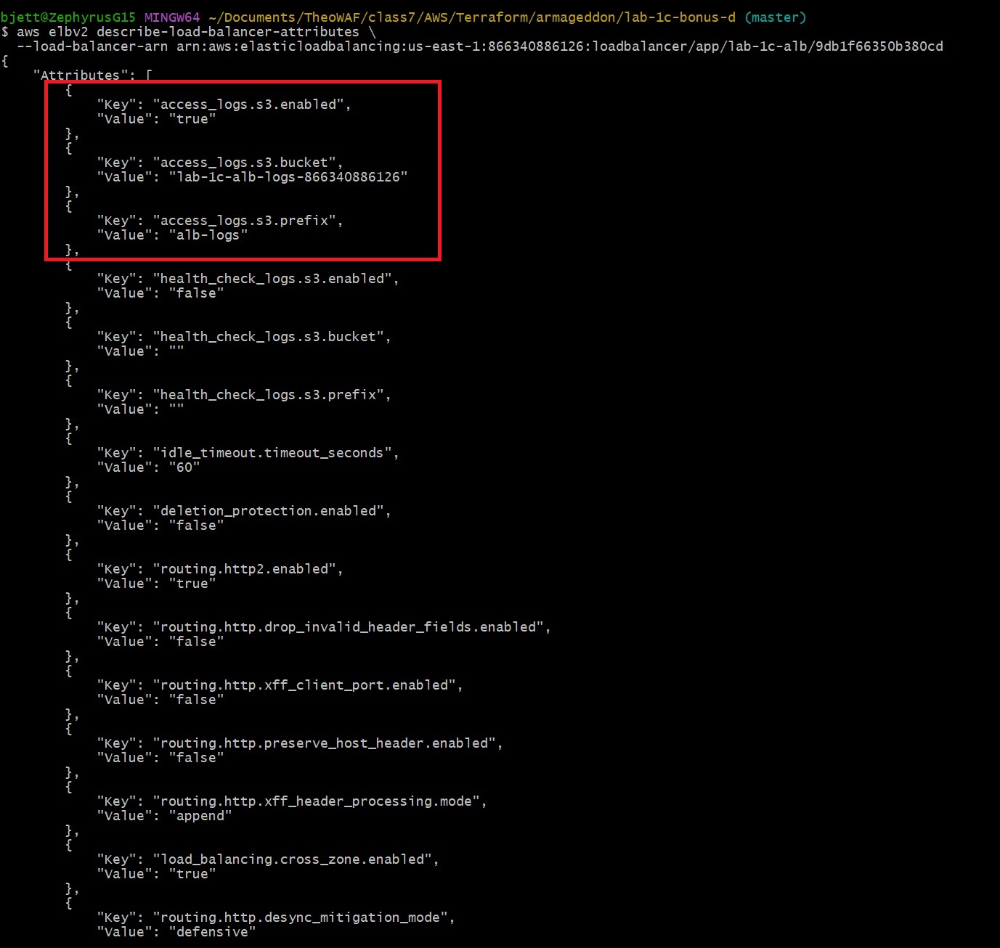
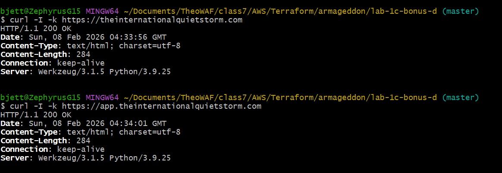
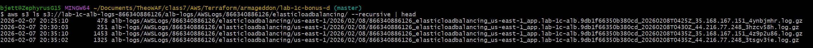

# 🛡️ AWS Lab 1C (Bonus C + Bonus D)

This document contains **CLI verification commands** used to confirm that the infrastructure meets all lab requirements.

Run commands from a machine with:

- AWS CLI installed
- Appropriate IAM read permissions
- Correct AWS region set

---

## 1️⃣ Confirm Hosted Zone Exists

```bash
aws route53 list-hosted-zones-by-name \
  --dns-name theinternationalquietstorm.com \
  --query "HostedZones[].Id"
```

Expected: Hosted zone ID returned.

---

## 2️⃣ Confirm Route53 Record Exists

```bash
aws route53 list-resource-record-sets \
  --hosted-zone-id Z00355293CPG0LM0BIYOR \
  --query "ResourceRecordSets[?Name=='theinternationalquietstorm.com.']"
```


Expected:

- Alias A record pointing to ALB DNS name

---

## 3️⃣ Confirm ACM Certificate Is Issued

```bash
aws acm describe-certificate \
  --certificate-arn arn:aws:acm:us-east-1:866340886126:certificate/9e091531-3230-42ff-b5f4-468d0031d795 \
  --query "Certificate.Status"
```

Expected:

```text
"ISSUED"
```

---

## 4️⃣ Confirm HTTPS Connectivity

```bash
curl -I -k https://theinternationalquietstorm.com
```


Expected:

- HTTP response headers returned
- TLS handshake successful

---

## 5️⃣ Bonus D — DNS + ALB Access Logging Verification

These steps prove enterprise-grade ingress observability.

### 5.1 Verify apex record exists (Route53)

```bash
aws route53 list-resource-record-sets \
  --hosted-zone-id Z00355293CPG0LM0BIYOR \
  --query "ResourceRecordSets[?Name=='theinternationalquietstorm.com.']"
```

Expected:

- Alias A record
- Target = Application Load Balancer DNS name

### 5.2 Verify ALB logging is enabled

```bash
aws elbv2 describe-load-balancers \
  --names lab-1c-alb \
  --query "LoadBalancers[0].LoadBalancerArn"
```



Then:

```bash
aws elbv2 describe-load-balancer-attributes \
  --load-balancer-arn arn:aws:elasticloadbalancing:us-east-1:866340886126:loadbalancer/app/lab-1c-alb/9db1f66350b380cd
```



Expected attributes include:

```plaintext
access_logs.s3.enabled = true
access_logs.s3.bucket  = lab-1c-alb-logs-866340886126
access_logs.s3.prefix  = alb-logs
```

### 5.3 Generate traffic

```plaintext
curl -I https://theinternationalquietstorm.com
curl -I https://app.theinternationalquietstorm.com
```



### 5.4 Verify logs arrived in S3

```bash
aws s3 ls s3://lab-1c-alb-logs-866340886126/alb-logs/AWSLogs/866340886126/elasticloadbalancing/ --recursive | head
```



Expected:

- Timestamped log objects appear
- Confirms ALB → S3 delivery path

---

## ✅ Bonus D Completion Criteria

All of the following must be true:

- Apex domain resolves to ALB
- HTTPS is reachable on apex and subdomain
- ALB access logging is enabled via Terraform
- Logs are delivered to S3
- Bucket policy enforces TLS and ownership safety

Failure of any step indicates:

- DNS misconfiguration
- ALB attribute mismatch
- S3 bucket policy error
