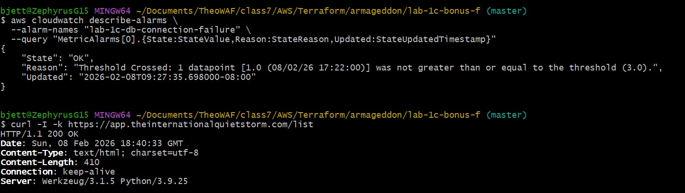

# 📋 **STEPS.md – Bonus F (CLI-Only Verification)**

---

## 1️⃣ Check CloudWatch Alarm State

```bash
aws cloudwatch describe-alarms \
  --alarm-names "lab-1c-db-connection-failure" \
  --query "MetricAlarms[0].StateValue,Reason:StateReason,Updated:StateUpdatedTimestamp"
```

Expected

```plaintext
{
  "State":"OK",
  "Reason":"Threshold Crossed: 1 out of the last 1 datapoints [0.0 (08/01/24 18:00:00)] was not greater than or equal to the threshold (1.0).",
  "Updated":"2024-08-01T18:00:00.000Z"
}
```

---

## 2️⃣ Generate Traffic

```bash
curl -I -k https://app.theinternationalquietstorm.com/
```

Expected



---
