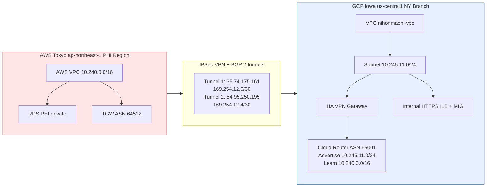

# Lab 4 (AWS Tokyo PHI + GCP Iowa Compute via HA VPN/BGP)

## Prereqs / Assumptions

- Terraform has already applied successfully (tunnels + BGP are **UP**).
- You know your internal ILB IP (example used below: **10.245.11.4**).
- You have SSH access to a GCP VM inside the `nihonmachi` subnet (via IAP or internal bastion).
- Your AWS Tokyo side is reachable over VPN and the RDS endpoint is resolvable/reachable from the GCP VM.
- Replace any example values (IPs, names) with your real outputs when they differ.

---

## Deliverable 1 — Private-only access proof

### Goal

Prove the Internal HTTPS Load Balancer is reachable **from inside the VPN corridor only**, and **not reachable from the public internet**.

### 1A) Show the Internal Forwarding Rule details

Run locally (or from Cloud Shell):

```bash
gcloud compute forwarding-rules describe lab-4-fr --region us-central1
````


Capture:

- `IPAddress` (this is the ILB IP)
- `loadBalancingScheme` (should be `INTERNAL_MANAGED`)
- `network` / `subnetwork`
- `ports`

### 1B) Prove it works *from inside* GCP (inside VPN environment)

SSH into a VM in the private subnet (IAP or internal path), then run:

```bash
curl -k https://10.245.11.4/health
curl -k https://10.245.11.4/
```


Expected:

- `/health` returns HTTP 200 (e.g., `ok`)
- `/` returns the landing content (e.g., “Nihonmachi Clinic (Private)”)

### 1C) Prove it does NOT work from the public internet

From a public network (your laptop without VPN into the VPC), attempt:

```bash
curl -k https://10.245.11.4/health
curl -k https://10.245.11.4/
```


Expected:

- It fails to connect / times out (because ILB is private RFC1918 and not routable publicly)

---

## Deliverable 2 — MIG proof

### Expected Results 1

Show the Managed Instance Group exists and is actually creating instances.

Run:

```bash
gcloud compute instance-groups managed list --regions us-central1
gcloud compute instances list --filter="name~nihonmachi-app"
```


Capture:

- MIG name (e.g., `nihonmachi-mig`)
- Region (`us-central1`)
- Instances created (names matching `nihonmachi-app-*`)
- Count of instances equals desired target size

---

## Deliverable 3 — Tokyo RDS connectivity proof

### Expected Results 2

Prove a VM in GCP can reach AWS Tokyo RDS **over the VPN corridor** and perform a small DB operation.

SSH into the VM (IAP / private path), then run:

```bash
python3 /usr/local/bin/rds_test.py
```


Expected:

- JSON output with `"status": "ok"` and a `latest_ts` (or similar success signal)
- If failure: capture error output and verify routing/security groups/DB endpoint

---

## Deliverable 4 — Network diagram (simple, clarity > artwork)

Use the diagram below as your deliverable (edit only if your IPs/ASNs differ):



---

## Deliverable 5 — Process Write-Up (6–10 sentences)

### Pre-shared keys (PSKs)

- PSKs were generated using a cryptographically secure password generator with high entropy (long, random, mixed character set). Each tunnel used a unique PSK to avoid shared failure domains and to support independent tunnel rotation. The PSKs were not written into Terraform code, committed to Git, or placed in screenshots, to prevent accidental disclosure and to avoid persistence in version history. Instead, the PSKs were stored temporarily in a secure secrets tool (e.g., password manager secure note) and shared out-of-band with the “other side” of the VPN as a one-time secret. During Terraform execution, PSKs were injected at runtime via a local, ignored secrets.auto.tfvars file or CLI variables, ensuring they were not distributed through collaboration channels. This matters in regulated environments because VPN credentials provide direct encrypted transport into sensitive networks, and any leakage can become an unauthorized access path. Proper PSK handling demonstrates process discipline and audit readiness, not just technical connectivity. In healthcare-style environments, secrets handling is part of compliance because it limits who can establish tunnels and reduces exposure to insider threat and accidental mishandling.

---

## Deliverable 6 — Compliance Statement (1 paragraph)

- No data is stored in GCP because the GCP Iowa environment is explicitly designed as compute-only: it hosts application instances behind a private internal HTTPS load balancer and does not deploy databases or persistent PHI storage. This satisfies Japanese privacy requirements by ensuring PHI remains resident in the authoritative data region (AWS Tokyo), with access occurring over encrypted IPSec VPN tunnels using BGP for tightly controlled, auditable routing; only approved CIDRs are exchanged and all transit is encrypted in motion. The branch compute layer in GCP only processes requests and, when needed, reaches back to Tokyo for database operations, so regulated data residency boundaries remain intact. “Multi-cloud” does not mean “multi-storage” because using multiple providers can separate concerns (compute vs. data) while keeping regulated data centralized; the architecture leverages multi-cloud for operational flexibility and regional compute without violating data localization rules or expanding the PHI storage footprint beyond Japan.

---

## Evidence Checklist (what to submit)

- [ ] Forwarding rule describe output
- [ ] Curl success from inside VM
- [ ] Curl failure from public internet
- [ ] MIG list output + instance list output
- [ ] `rds_test.py` success output
- [ ] Network diagram (Mermaid code is presented above)
- [ ] Process write-up paragraph
- [ ] Compliance statement paragraph
