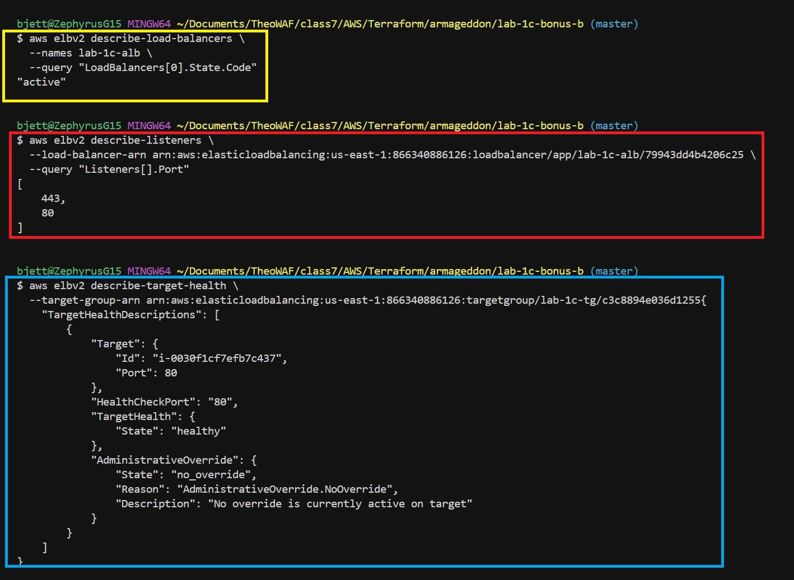
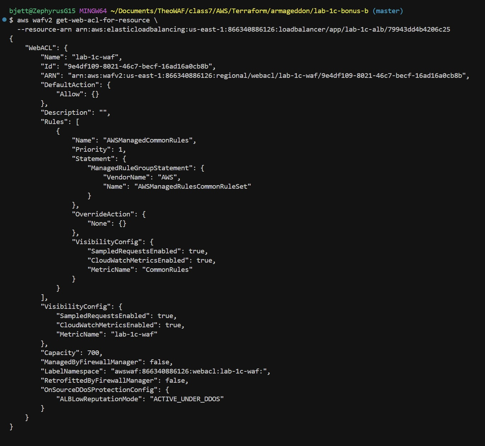
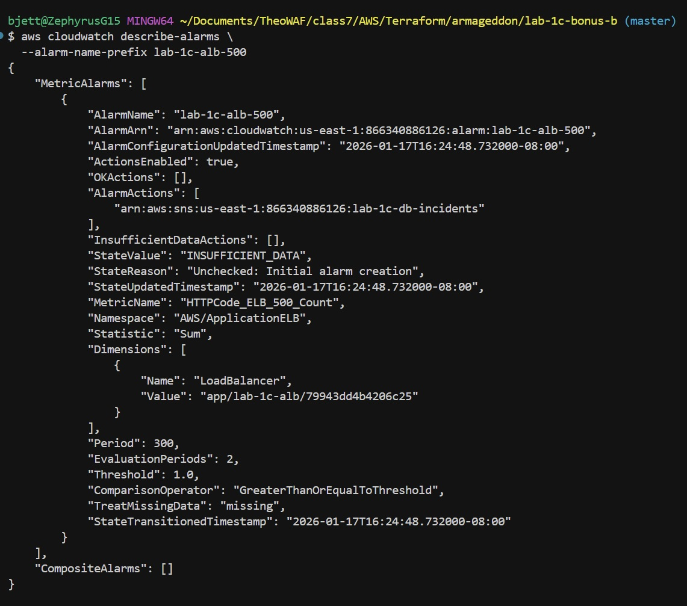
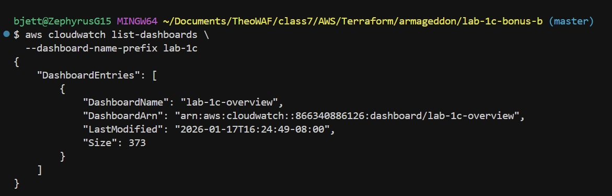

# Lab 1C – Bonus B (Public ALB + Private EC2 + TLS + WAF + Monitoring)

This document contains **CLI-only verification steps** used to validate that **Lab 1C – Bonus B** infrastructure is deployed correctly and operating as designed.

All commands are **read-only** and may be executed after a successful `terraform apply`.

> **Prerequisites**
>
> - AWS CLI configured
> - IAM permissions to read: ELBv2, WAFv2, CloudWatch, SNS
> - Correct AWS region set (e.g. `us-east-1`)

---

## 1️⃣ Confirm the Application Load Balancer exists and is active

```bash
aws elbv2 describe-load-balancers \
  --names lab-1c-alb \
  --query "LoadBalancers[0].State.Code" \
  --output text
```

### **Output (1)**

```plaintext
active
```

---

## 2️⃣ Verify ALB listeners (HTTP → HTTPS redirect + HTTPS listener)

```bash
aws elbv2 describe-listeners \
  --load-balancer-arn "$ALB_ARN" \
  --query "Listeners[].{Port:Port,Protocol:Protocol}" \
  --output table
```

### **Output (2)**

- Port **80** (HTTP – redirect)
- Port **443** (HTTPS – ACM certificate attached)

---

## 3️⃣ Confirm target group exists and is healthy

```bash
aws elbv2 describe-target-health \
  --target-group-arn "$TG_ARN" \
  --query "TargetHealthDescriptions[].TargetHealth.State"
```

### **Output (3)**

```plaintext
[
  "healthy"
]
```



---

## 4️⃣ Verify WAF is attached to the ALB

```bash
aws wafv2 get-web-acl-for-resource \
  --resource-arn "$ALB_ARN"
  ```

### **Output (4)**

```plaintext
{
    "WebACL": {
        "Name": "lab-1c-waf",
        "ARN": "arn:aws:wafv2:us-east-1:123456789012:regional/webacl/lab-1c-waf/abcd1234-5678-90ab-cdef-EXAMPLE11111"
    }
}
```

This confirms:

- WAF is attached to the ALB
- Web ACL name and ARN match expected values



---

## 5️⃣ Confirm ALB 500 CloudWatch alarm exists

```bash
aws cloudwatch describe-alarms \
  --alarm-name-prefix lab-1c-alb-500 \
```

### **Output (5)**

```plaintext
{
    "MetricAlarms": [
        {
            "AlarmName": "lab-1c-alb-500-errors",
            "AlarmArn": "arn:aws:cloudwatch:us-east-1:123456789012:alarm:lab-1c-alb-500-errors",
            "StateValue": "OK"
        }
    ]
}
```



---

## 6️⃣ Confirm ALB 500 CloudWatch alarm exists

```bash
aws cloudwatch list-dashboards \
  --dashboard-name-prefix lab-1c \
```

### **Output (6)**

```plaintext
{
    "DashboardEntries": [
        {
            "DashboardName": "lab-1c-dashboard",
            "DashboardArn": "arn:aws:cloudwatch:us-east-1:123456789012:dashboard/lab-1c-dashboard"
        }
    ]
}
```



---

## ✅ Completion Criteria

All of the following must be true:

- ALB state is **active**
- HTTPS listener exists on **443**
- Target health is **healthy**
- WAF is attached to the ALB
- 500 alarm exists
- CloudWatch dashboard is present

If any command fails or returns no output:

- Verify resource names
- Check Terraform state
- Review the most recent `terraform apply` output

---
