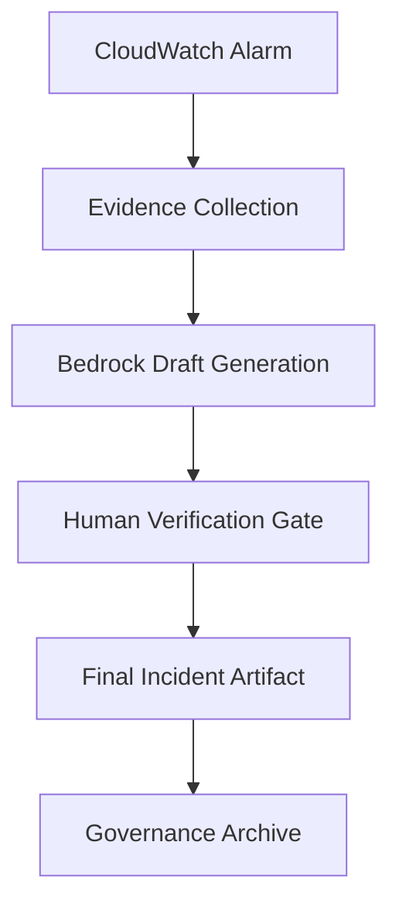

# Amazon Bedrock–Assisted Incident Response Runbook


**Enterprise Governance Edition**  
**Version 1.0**

---

## Document Control

| Field          | Value               |
|----------------|---------------------|
| Document Owner | Platform Security   |
| Approved By    | Incident Commander  |
| Version        | 1.0                 |
| Last Updated   | 2026-02-19          |
| Review Cycle   | Quarterly           |
| Classification | Internal Governance |

---

## Executive Purpose

This runbook formalizes a **human-verified, AI-assisted incident response model** using Amazon Bedrock.

> **Core Principle:**  
> AI accelerates analysis. Humans own correctness.

The framework ensures:

- Evidence-first investigation
- Explicit evidence-to-claim mapping
- Governance and audit traceability
- Zero plaintext secret exposure
- Formalized incident artifact structure

---

## Architecture Overview

### AI-Assisted Incident Flow



---

## Required Incident Report Structure

1. Executive Summary
2. Timeline (UTC)
3. Scope & Blast Radius
4. Evidence Collected
5. Root Cause Analysis
6. Resolution
7. Preventive Actions
8. Evidence Citations
9. Redaction Statement
10. Appendix

No section may be omitted.

---

## AI Safety Controls

### Prohibited

- AI access to live credentials
- Automated production remediation
- Unverified assertions in final artifact

### Required

- All claims must cite evidence
- Confidence rating assigned by human
- Model ID recorded
- Secrets redacted

---

### Confidence Model

| Level  | Definition                              |
| ------ | --------------------------------------- |
| High   | Direct telemetry confirmation           |
| Medium | Correlated signals                      |
| Low    | Hypothesis requiring further validation |

AI outputs default to **Medium** until human verification.

---

### NIST 800-61 Mapping

| NIST Phase           | Runbook Component                   |
| -------------------- | ----------------------------------- |
| Preparation          | Logging, alarm configuration        |
| Detection & Analysis | Evidence collection + Bedrock draft |
| Containment          | Corrective remediation actions      |
| Eradication          | Configuration correction            |
| Recovery             | Validation + monitoring             |
| Post-Incident        | Preventive controls + archival      |

---

## SOC 2 Alignment (Trust Services Criteria)

| SOC 2 Category       | Control Coverage           |
| -------------------- | -------------------------- |
| Security             | Access control & redaction |
| Availability         | Alarm-driven response      |
| Processing Integrity | Evidence validation        |
| Confidentiality      | Secret redaction controls  |

---

## ISO 27001 Alignment

| ISO Control                       | Mapping                 |
| --------------------------------- | ----------------------- |
| A.5 Information Security Policies | Formalized runbook      |
| A.8 Asset Management              | Configuration tracking  |
| A.12 Operations Security          | Logging & monitoring    |
| A.16 Incident Management          | Structured IR lifecycle |

---

## Model Audit Log (Required)

Every incident must record:

```yaml
model_id: Amazon Nova Lite v1
generation_timestamp: <UTC>
reviewed_by: T.I.Q.S. DevSecOps Team
approved_by: John Sweeney
confidence_assigned_by: Suge WAF
```

---

## Archival & Compliance

- Store in secured incident repository
- Retain per compliance policy (3–7 years typical)
- Immutable storage recommended (S3 Object Lock)

---

## Footer

- **Document Version 1.0**
- **Amazon Bedrock–Assisted IR Runbook**
- **© 2026 Brotherhood of Evil jerMutants - Wolfpack**
