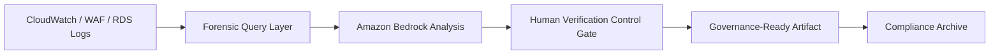

# T.I.Q.S. DevSecOps™ Incident Intelligence Framework

---

- **title:** T.I.Q.S. DevSecOps™ Incident Intelligence Framework
- **version:** 1.0
- **portfolio:** Enterprise Showcase
- **author:** T.I.Q.S. DevSecOps

---


> AI-Augmented • Evidence-First • Governance-Driven

---

## Vision

A structured, AI-assisted, human-verified incident intelligence framework engineered for enterprise cloud environments.

This framework demonstrates:

- AI safety engineering
- Cloud-native forensic workflows
- Governance discipline
- DevSecOps maturity

---

## Enterprise Architecture



---

## Framework Pillars

### 1. Evidence-First Investigation

- Alarm validation
- Logs Insights forensic queries
- WAF telemetry correlation
- Drift inspection

### 2. AI-Augmented Acceleration

- Timeline reconstruction
- Root cause hypothesis generation
- Preventive control suggestions

### 3. Human Accountability Layer

- Mandatory verification checkpoint
- Confidence rating enforcement
- Redaction compliance

### 4. Preventive Engineering Feedback Loop

- Secrets rotation automation
- Drift detection
- IaC enforcement
- Post-incident guardrail updates

---

## Governance Controls

- No AI direct access to production
- No auto-remediation
- All claims traceable to telemetry
- Model ID recorded for audit

---

## NIST 800-61 Integration

| Phase           | Implementation             |
| --------------- | -------------------------- |
| Preparation     | Monitoring & alert design  |
| Detection       | Logs + Bedrock analysis    |
| Containment     | Controlled remediation     |
| Eradication     | Configuration correction   |
| Recovery        | Telemetry validation       |
| Lessons Learned | Preventive control updates |

---

## SOC 2 Readiness

| Domain               | Framework Capability          |
| -------------------- | ----------------------------- |
| Security             | Controlled access + redaction |
| Availability         | Alarm-driven workflow         |
| Confidentiality      | Secrets isolation             |
| Processing Integrity | Evidence-based claims         |

---

## ISO 27001 Mapping

| Control            | Implementation        |
| ------------------ | --------------------- |
| A.12 Logging       | Centralized telemetry |
| A.16 IR Management | Structured workflow   |
| A.18 Compliance    | Audit-ready artifact  |

---

## Model Governance Block

```yaml
model_id: amazon.titan-text-express-v1
ai_role: draft_generation_only
human_owner: incident_commander
verification_required: true
confidence_assignment: human_only
```

---

## Professional Presentation Guidance

For GitHub showcase:

- Use dark/light adaptive badges
- Include architecture PNG exports of Mermaid diagrams
- Add screenshots of CloudWatch queries
- Add real incident example (redacted)
- Add repository structure section

---

## Portfolio Positioning

This framework demonstrates:

✔ AI safety discipline
✔ Enterprise IR maturity
✔ Governance-first DevSecOps
✔ Compliance alignment
✔ Structured cloud operations

---

## Footer

- **T.I.Q.S. DevSecOps™**
- **Incident Intelligence Framework v1.0**
- **© 2026 T.I.Q.S. Portfolio**
